# Beginner Architecture Diagrams — SST

## Purpose

High-level, **as-is** diagrams of Service Staffing Tracker for demos, onboarding talks, and slides. Each section has a short caption you can read aloud.

**Prefer a prose walkthrough first?** Start with [BEGINNER_HIGH_LEVEL_ARCHITECTURE.md](./BEGINNER_HIGH_LEVEL_ARCHITECTURE.md).

## Audience

New engineers, product partners, stakeholders who need the big picture without NestJS detail.

## Scope

**MVP that runs today** (React SPA + NestJS modular monolith + PostgreSQL). Not covered: Redis, microservices, mobile, WebSocket, future workforce modules.

## As-is stack (cheat sheet)

| Piece | Real path | Role |
|-------|-----------|------|
| Browser SPA | `apps/RecuirementDashboard` | React + Vite UI |
| Backend API | `apps/api` | NestJS REST, JWT, Prisma |
| Database | PostgreSQL 16 | Single source of truth |
| Shared code | `packages/shared-types`, `packages/shared-utils` | Zod schemas / pure helpers |
| Optional | Company SMTP, Prometheus `/metrics` | Email and ops |

**Not in the product:** Redis, WebSocket, MQTT, mobile/desktop agents, message queues, BFF.

## Talk track (present in this order)

1. **Problem** — staffing was tracked in Excel; SST digitizes the same pipeline in one app.
2. **Users** — Sales, TA, HR, Admin (roles control what each person can do).
3. **Two apps** — one browser UI and one API, not a swarm of microservices.
4. **One brain** — PostgreSQL stores users, requirements, candidates, offers, onboarding, audit.
5. **Security** — login issues a JWT; the API checks role before each action.
6. **How it ships** — monorepo builds together; Docker can run web + API + Postgres together.
7. **Why modular monolith** — one deployable today; folders mirror future module boundaries.

---

## 1. Elevator pitch

**Say this:** People open one website. That website talks to one backend. The backend reads and writes one database.

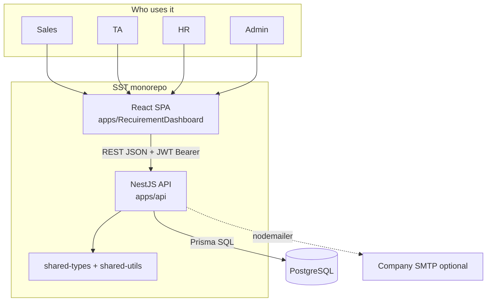

---

## 2. C4 Level 1 — Context

**Say this:** The system sits between hiring roles and a few external things: optional company email, and one-time Excel/CSV import for migration.

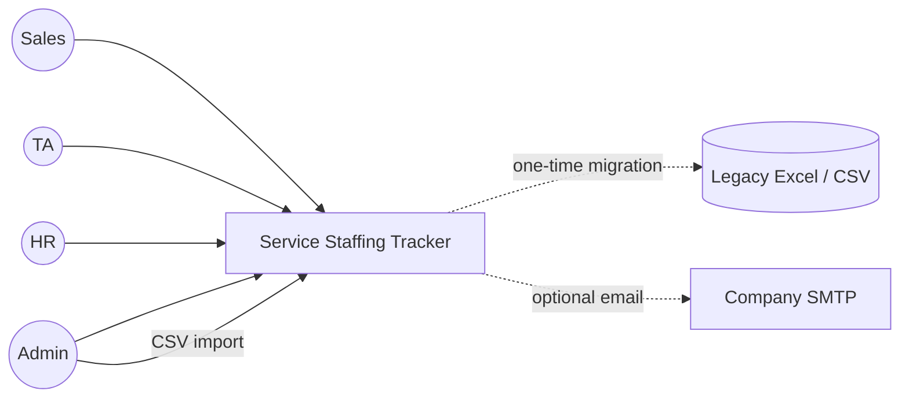

| Role | Typical job in SST |
|------|--------------------|
| Sales | Open and track client requirements |
| TA / TA Lead | Own pipeline, candidates, handoffs |
| HR / HR Lead | Offers and onboarding |
| Admin | Users, master data, import, audit |

---

## 3. C4 Level 2 — Containers

**Say this:** Three main boxes run the app. Monitoring and mail are optional add-ons, not required for core CRUD.

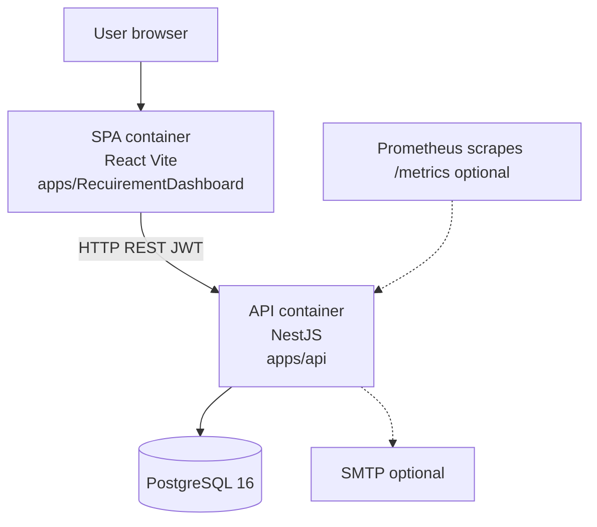

| Container | Technology | Dev port (typical) |
|-----------|------------|--------------------|
| SPA | React + Vite | 5173 |
| API | NestJS | 3000 (`/api/v1`, Swagger `/api/docs`) |
| DB | PostgreSQL 16 | host **5433** → container 5432 |

---

## 4. Monorepo map

**Say this:** One repository holds UI, API, shared libraries, and Docker files so the team versions everything together (Turborepo + pnpm).

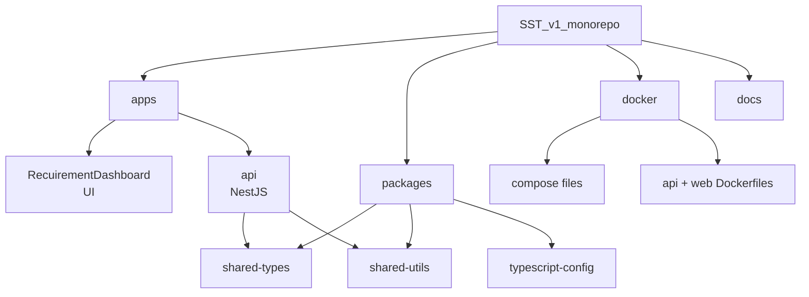

**Dependency rule:** apps depend on packages; apps do not import each other.

---

## 5. Business pipeline

**Say this:** The domain is a straight hiring pipe—same story as the old Excel tracker.

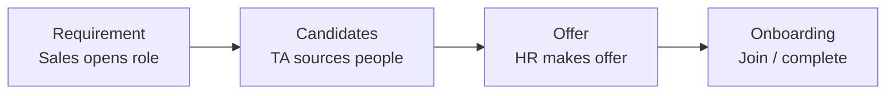

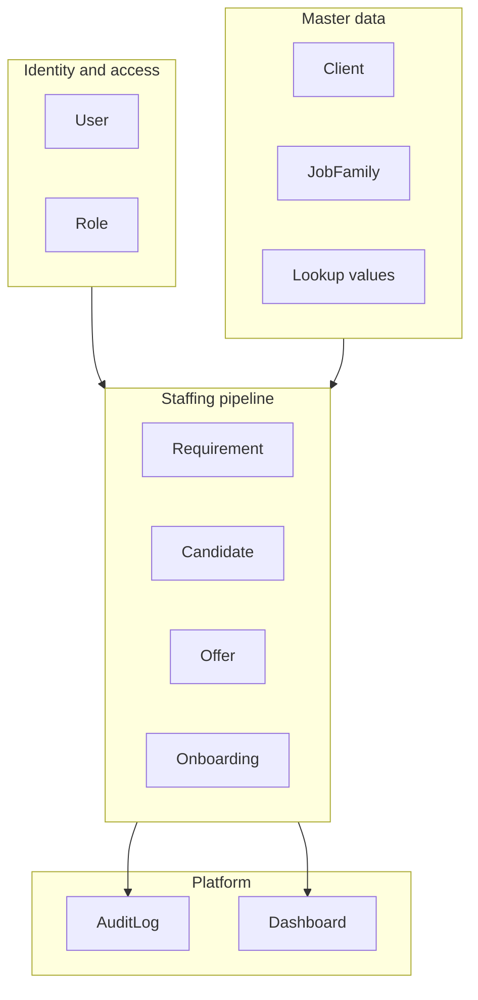

---

## 6. API modules (modular monolith)

**Say this:** One NestJS process, many folders. Each module owns a business area; the whole API still deploys as a single unit.

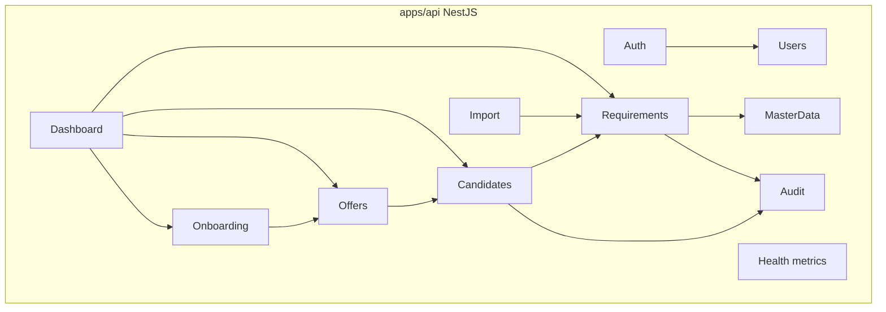

| Module | What beginners should remember |
|--------|--------------------------------|
| Auth | Login, refresh, logout, “who am I” |
| Users | Accounts and roles |
| MasterData | Clients, job families, lookup lists |
| Requirements / Candidates / Offers / Onboarding | Pipeline write path |
| Dashboard | KPI / aggregation reads |
| Audit | Who changed what |
| Import | CSV validate + commit |
| Health | `/health`, `/ready`, `/metrics` |

---

## 7. One request end-to-end

**Say this:** A click never talks to the database directly. The SPA sends HTTP; guards check identity and role; a service uses Prisma; JSON comes back.

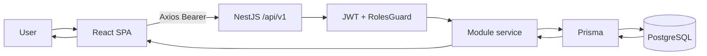

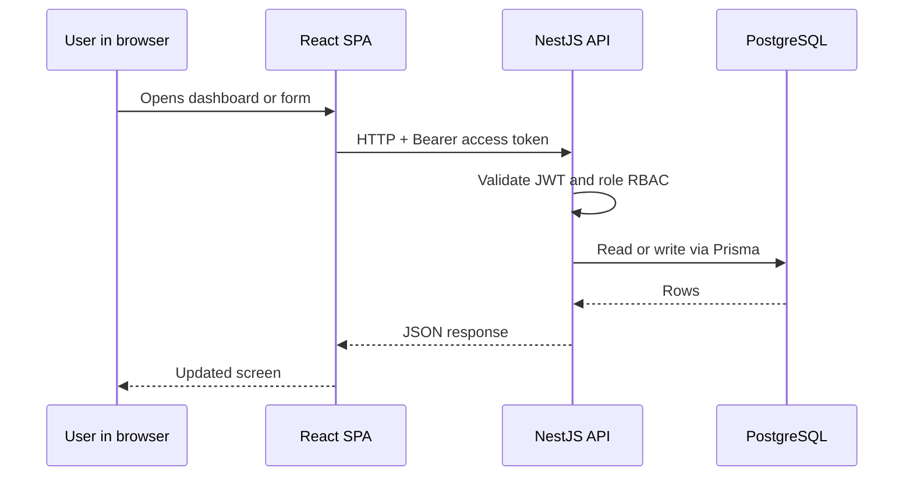

**API shape:** protected business routes live under `/api/v1/*`. Health/metrics are public ops endpoints on the same process.

---

## 8. Auth sequence

**Say this:** Login proves password, returns tokens. Later calls use the short-lived access token. On 401 the SPA refreshes; logout invalidates the session path.

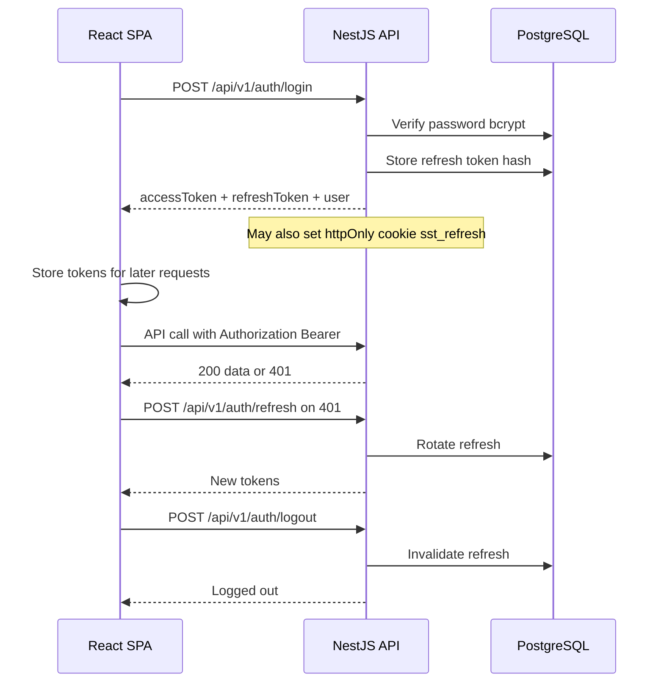

**Roles (examples):** `ADMIN`, `SALES`, `SALES_LEAD`, `TA`, `TA_LEAD`, `HR`, `HR_LEAD`.

---

## 9. Deployment views

### Local development

**Say this:** Develop with Postgres in Docker; run API and SPA on the host via `pnpm dev`.

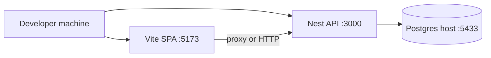

| Service | URL |
|---------|-----|
| Web | http://localhost:5173 |
| API health | http://localhost:3000/health |
| Swagger | http://localhost:3000/api/docs |

### Production-style Docker Compose

**Say this:** One Compose stack: nginx serves the built SPA and proxies `/api` to Nest; Nest talks to Postgres.

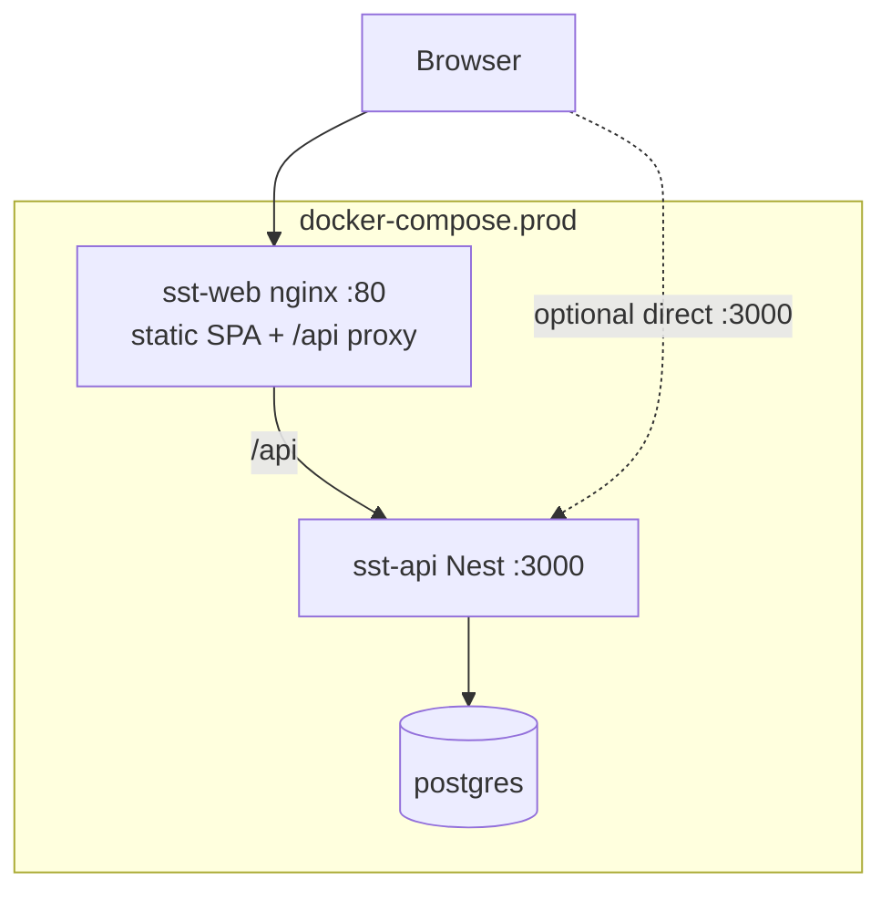

Typical operator entry: Compose files under `docker/`; handoff notes in `docs/17-local-deployment/DEPLOY_V1.md`.

---

## Mermaid vs draw.io

| Format | Best for | How |
|--------|----------|-----|
| **Mermaid in this Markdown** | GitHub, Cursor preview, demos | Open this file; or paste a diagram into [mermaid.live](https://mermaid.live) |
| **draw.io / diagrams.net** | PowerPoint-style edits, logos, colors | **Arrange → Insert → Advanced → Mermaid**, paste the diagram body (without the outer ` ```mermaid ` fences if the UI asks for raw Mermaid). Or export SVG/PNG from mermaid.live and drop into draw.io |

Keep Mermaid as the source of truth; re-import after edits so slides stay aligned with this doc.

---

## Accuracy notes (as-is vs older docs)

| Topic | Use this (as-is) |
|-------|------------------|
| Web folder | `apps/RecuirementDashboard` (not always `apps/web` in older prose) |
| Local Postgres | Host port **5433** |
| Core data path | SPA → REST → Nest → Prisma → PostgreSQL |
| Optional | SMTP email, Prometheus metrics |
| Not MVP runtime | Redis, WebSocket, agents, full Loki stack |

---

## References

- [ENTERPRISE_HIGH_LEVEL_DIAGRAMS.md](./ENTERPRISE_HIGH_LEVEL_DIAGRAMS.md) — enterprise diagram pack  
- [BEGINNER_HIGH_LEVEL_ARCHITECTURE.md](./BEGINNER_HIGH_LEVEL_ARCHITECTURE.md) — plain-language beginner HLA  
- [HIGH_LEVEL_ARCHITECTURE.md](./HIGH_LEVEL_ARCHITECTURE.md) — engineer HLA  
- [C4_MODEL.md](./C4_MODEL.md) — C4 detail  
- [SEQUENCE_DIAGRAMS.md](./SEQUENCE_DIAGRAMS.md) — more sequences  
- [DATA_FLOW.md](./DATA_FLOW.md) — data-flow views  
- [DEPLOYMENT.md](./DEPLOYMENT.md) — deploy topology  
- [../04-domain/DOMAIN_MODEL.md](../04-domain/DOMAIN_MODEL.md) — domain  
- [../11-security/AUTH_RBAC.md](../11-security/AUTH_RBAC.md) — auth/RBAC  
- [../13-monorepo/MONOREPO_STRUCTURE.md](../13-monorepo/MONOREPO_STRUCTURE.md) — monorepo  
- [../17-local-deployment/DEPLOY_V1.md](../17-local-deployment/DEPLOY_V1.md) — operator runbook  
