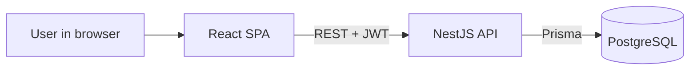
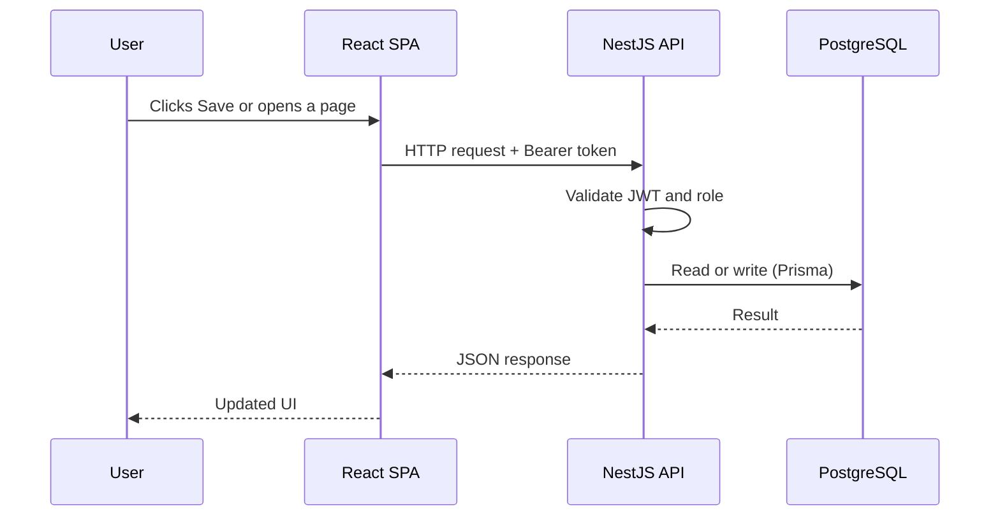
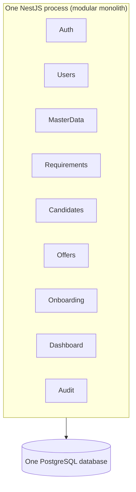
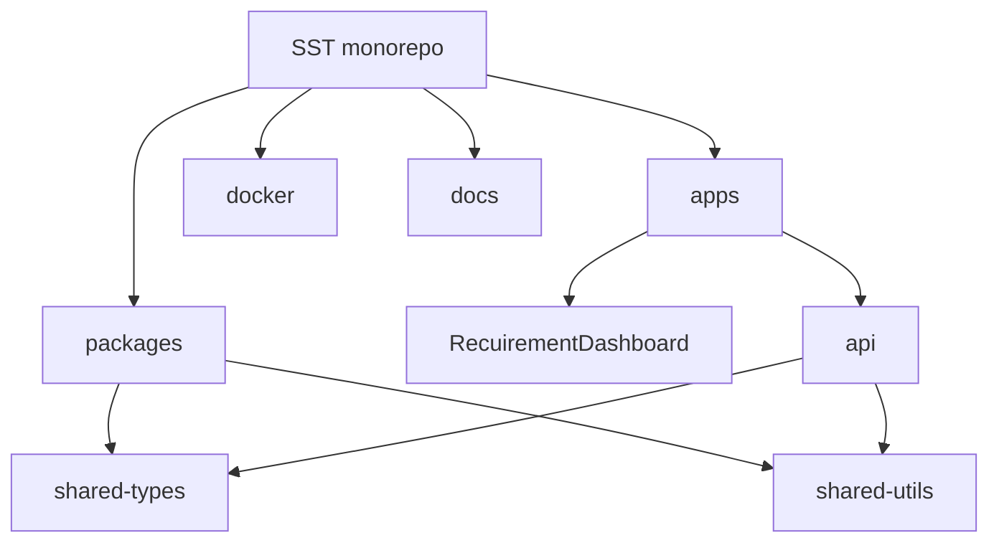
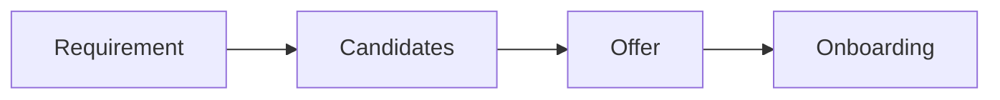
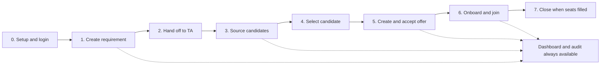
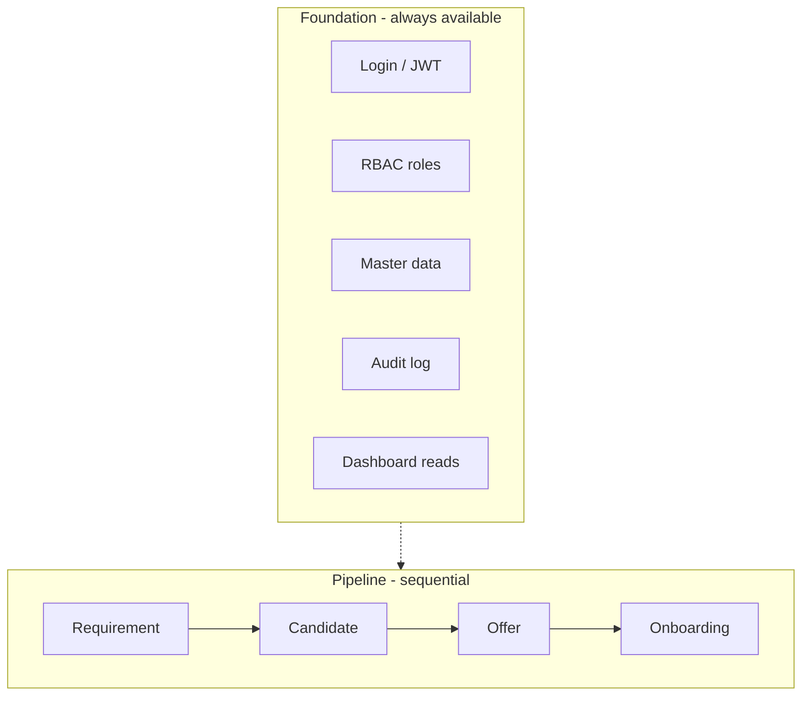
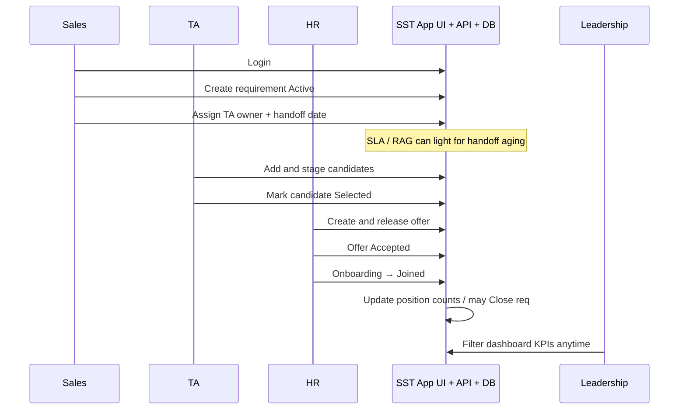

# High-Level Architecture (Beginner Guide) — SST

## Purpose

Explain the **big picture** of Service Staffing Tracker in plain language: what the app is, which pieces exist, how they talk to each other, and what is intentionally *not* built yet.

## Who this is for

- New engineers joining the team  
- Product / QA / leads who need system context without deep NestJS or React details  
- Anyone who wants “how is this app put together?” before reading advanced design docs  

## Time to read

About **10–15 minutes**.

## What you will understand by the end

1. What problem SST solves  
2. The main building blocks (UI, API, database)  
3. How a user action flows through the system  
4. How folders in the monorepo map to those blocks  
5. What “modular monolith” means (and why we use it)  
6. The **end-to-end business workflow** from login to a candidate joining  
7. Where to go next for deeper detail  

> **Diagram twin:** If you prefer slides and read-aloud captions, use [BEGINNER_ARCHITECTURE_DIAGRAMS.md](./BEGINNER_ARCHITECTURE_DIAGRAMS.md). This guide is the **story**; that file is the **visual pack**.

---

## 1. Start here: the one-picture version

At the highest level, SST is only three running things most people need to care about:

```text
   Person using a browser
            │
            │  opens the website
            ▼
   ┌─────────────────────┐
   │  Frontend (SPA)     │   React app — screens, tables, forms
   │  apps/RecuirementDashboard
   └──────────┬──────────┘
              │  HTTP requests + login token (JWT)
              ▼
   ┌─────────────────────┐
   │  Backend (API)      │   NestJS — business rules, security, data access
   │  apps/api           │
   └──────────┬──────────┘
              │  SQL via Prisma
              ▼
   ┌─────────────────────┐
   │  Database           │   PostgreSQL — single source of truth
   └─────────────────────┘
```

**In one sentence:**  
Users work in a web UI → the UI calls one REST API → the API reads and writes one PostgreSQL database.

There is **no** swarm of microservices in MVP. There is **no** separate BFF (“backend for frontend”) layer. One UI. One API. One primary database.



---

## 2. Why this application exists (business context)

Before SST, staffing work lived mainly in **Excel**: open roles, candidates, offers, onboarding, dashboards.

Spreadsheets are hard to run as a real multi-user product:

| Spreadsheet pain | What SST adds |
|------------------|----------------|
| Concurrent edits collide or get lost | Real multi-user web app |
| Anyone with the file sees everything | Login + roles (RBAC) |
| Hard to know who changed what | Audit trail |
| KPI sheets break easily | Server-calculated dashboard data |
| No clean place for future features | Architecture with module boundaries |

**SST MVP** digitizes the **hiring pipeline** from that Excel world:

```text
Requirement → Candidates → Offer → Onboarding
                 +
           Dashboard + Master data
                 +
           Login, roles, audit
```

**Not in MVP (Future):** bench, skills matrix, capacity, assignments, full workforce planning. The code and folders leave *room* for those later; they are not the current product.

---

## 3. Who uses the system

Different roles use the **same** website. The **API** decides what each role is allowed to do.

| Role | Plain-English job in SST |
|------|---------------------------|
| **Sales** | Create and track client **requirements** (open roles to fill) |
| **TA** (Talent Acquisition) | Work the **candidate** pipeline, selection |
| **HR** | **Offers** and **onboarding** after selection |
| **Admin** | Users, master data (clients, lists), import, full access |
| **Leadership (read-only)** | Dashboards and reports without editing pipeline data |

Think of the frontend as “the office app” and the API as “the security desk + filing rules + the filing cabinet logic.”

---

## 4. The three containers (what actually runs)

In architecture language, a **container** is a separately runnable piece (not a Docker container only—though we often put these *in* Docker).

| Container | Everyday name | Technology | Job |
|-----------|---------------|------------|-----|
| **SPA** | The website UI | React + Vite | Screens, forms, tables; calls the API |
| **API** | The backend | NestJS | Auth, business rules, CRUD, dashboards, audit |
| **DB** | The database | PostgreSQL | Stores all durable data permanently |

Optional add-ons (nice to have, not the core product):

- **Company email (SMTP)** — e.g. notify someone when something happens  
- **Metrics (/metrics)** — Prometheus-style ops monitoring  

### Typical local ports

| What | Where you open it |
|------|-------------------|
| Website | `http://localhost:5173` |
| API | `http://localhost:3000` |
| API health | `http://localhost:3000/health` |
| Swagger (API docs UI) | `http://localhost:3000/api/docs` |
| PostgreSQL | Often host port **5433** → container 5432 |

---

## 5. How a click becomes data (request journey)

When a user saves a form or opens a list, the data does **not** go browser → database. The path is always:

```text
1. User clicks something in the React SPA
2. SPA sends an HTTP request to NestJS  (e.g. GET/POST /api/v1/...)
3. API checks: is this person logged in? (JWT)
4. API checks: is this role allowed? (RBAC)
5. API service applies business rules
6. Prisma talks to PostgreSQL
7. API returns JSON
8. SPA updates the screen
```



**Takeaway for beginners:** all serious rules (permissions, duplicate checks, stage rules like “onboarding only after offer accepted”) belong on the **API**, not only in the UI. The UI can hide buttons, but the backend is the truth enforcer.

---

## 6. What “modular monolith” means (simple version)

### Monolith

One backend **application** (one NestJS process you deploy and scale as a unit).

### Modular

Inside that one API, code is split into **modules** by business area—like folders that own a topic:

| Module area | Owns |
|-------------|------|
| Auth | Login, tokens, who is this user |
| Users | Accounts and roles |
| Master data | Clients, job families, setup lists |
| Requirements | Open staffing needs |
| Candidates | People in the TA pipeline |
| Offers | Offer lifecycle |
| Onboarding | Join / docs / DOJ-style flow |
| Dashboard | KPI reads and filters |
| Audit | “Who changed what” |
| Import | CSV bridge from Excel-style data |
| Health | Up / ready / metrics |

You **deploy one API**, not twelve microservices. Folders stay clean so a future team *could* split services later if needed.



---

## 7. Layer cake inside the API (still beginner level)

Inside each feature module, work is layered so responsibilities stay clear:

```text
Controller   → receives HTTP, returns HTTP
Service      → business use cases / orchestration
Repository   → talks to Prisma / database
   +
Guards       → identity and roles
Pipes/DTOs   → validate input shape
```

You do **not** need to memorize every NestJS decorator to understand the architecture. Remember:

- **Controllers** are the doors.  
- **Services** are the office procedure.  
- **Repositories / Prisma** are the filing cabinet.  
- **Guards** are the security badge check.

---

## 8. The monorepo (one Git repo for the whole product)

SST lives in a **monorepo**: frontend, backend, shared libraries, Docker, and docs version-controlled together.

```text
SST_v1_monorepo/
├── apps/
│   ├── RecuirementDashboard/   ← the website (React SPA)
│   └── api/                    ← the backend (NestJS)
├── packages/
│   ├── shared-types/           ← shared contracts / schemas
│   ├── shared-utils/           ← shared pure helpers
│   └── typescript-config/      ← shared TypeScript config
├── docker/                     ← Compose files, container recipes
└── docs/                       ← this documentation tree
```

**Tools that glue the repo together:**

| Tool | Plain meaning |
|------|----------------|
| **pnpm workspaces** | Multiple packages in one repo with shared install |
| **Turborepo** | Smart task runner (build/lint/test in the right order) |

**Rule of thumb:** apps may use packages. Apps should **not** import each other’s internals.



---

## 9. Frontend architecture (high level only)

The SPA is a **single-page application**: the browser loads the app once, then routes and data fetch happen without full classic page reloads for most flows.

Rough responsibilities:

| Concern | Approach (conceptually) |
|---------|-------------------------|
| Pages / features | Feature folders (requirements, candidates, …) |
| Calling the API | HTTP client with the login token attached |
| Server data | Query/cache layer (TanStack Query style) |
| Access to screens | Routes that respect login and role |
| Look and feel | Dense, table-first, Excel-familiar UX |

The SPA is a **client of the API**. It should not be the only place enforcing business law.

---

## 10. Data and system of record

**PostgreSQL** is the **system of record (SoR)**: if it is not in the database (or correctly derived from what is in the database), it is not the official business truth.

Examples of what lives there:

- Users and roles  
- Master data (clients, lookups)  
- Requirements, candidates, offers, onboarding  
- Audit log entries  

**Prisma** is the library the API uses to map TypeScript code to SQL tables safely (schema + queries + migrations).

Soft concepts beginners should know:

- **SoR** — database is authoritative  
- **Derived fields** — e.g. open vs filled counts should be calculated, not casually free-typed against the real counts  
- **Soft delete** — often “mark deleted” rather than hard-wipe, when the design says so  

---

## 11. Security in one page

```text
Login (email + password)
        │
        ▼
API returns tokens (access + refresh)
        │
        ▼
SPA sends access token on each protected API call
        │
        ▼
API verifies token and role before running the action
```

| Term | Friendly meaning |
|------|------------------|
| **Authentication** | “Who are you?” |
| **Authorization (RBAC)** | “What are you allowed to do?” |
| **JWT** | A signed token that proves login for a short time |
| **Refresh token** | Longer-lived token used to get a new access token |
| **Audit** | Record that something important changed, by whom, when |

Protected business APIs live mainly under **`/api/v1/...`**. Health and metrics are separate ops-style endpoints on the same API process.

---

## 12. Business pipeline as architecture

Architecture follows the **hiring pipeline**, not random page names.



Cross-cutting capabilities wrap the whole pipe:

```text
                    Master data  (clients, lists)
                           │
  Auth / roles ─────►  Pipeline modules  ─────► Dashboard
                           │
                        Audit log
```

**Important stage idea (example):**  
an offer only makes sense after selection; onboarding only after an accepted offer. Those rules are **domain rules**; modules exist to protect that order.

---

## 13. End-to-end workflow of the application

This section walks the **full product journey** in order—who does what, what the system records, and which part of the architecture is involved. Use it as the “story of SST” before you open individual feature code.

### 13.1 Big picture (happy path)

A staffing request starts with Sales, moves through TA (candidates), then HR (offer + onboarding), until someone **joins**. Leadership watches progress on the dashboard at any time. Admin keeps the system configured.



| Stage | Primary role | Main record | Pipeline module |
|-------|--------------|-------------|-----------------|
| 0. Setup & login | Admin + every user | User, master lists | Auth, Users, MasterData |
| 1. Open need | Sales | Requirement | Requirements |
| 2. Ready for TA | Sales / Admin | Requirement (TA owner + handoff date) | Requirements |
| 3. Pipeline | TA | Candidate(s) | Candidates |
| 4. Selection | TA | Candidate (`selected`) | Candidates |
| 5. Offer | HR (sometimes TA) | Offer | Offers |
| 6. Join path | HR | Onboarding | Onboarding |
| 7. Filled / closed | System + owners | Requirement terminal state | Requirements + Dashboard |

### 13.2 Always-on foundation (before the pipeline)

These run across the whole product, not only at step 1.

| Concern | What happens | Why it matters |
|---------|--------------|----------------|
| **Login** | User opens SPA → credentials → API issues JWT → SPA calls protected APIs with token | No anonymous pipeline edits |
| **Roles (RBAC)** | Every protected API checks role against what the user is trying to do | Sales cannot arbitrarily act as HR beyond policy |
| **Master data** | Clients, job families, lookup lists (stages, statuses) exist first | Forms stay consistent; filters work |
| **Audit** | Important create/update/delete actions leave a trail | Accountability for multi-user ops |
| **Dashboard** | Any time after data exists, users filter KPIs | Leadership visibility without Excel formulas |



### 13.3 Stage-by-stage workflow

#### Stage 0 — Enter the system

| Item | Detail |
|------|--------|
| **Actor** | Any registered user |
| **User steps** | Open website → Login → land on home / role-default area |
| **System steps** | Verify password → issue access + refresh tokens → return user + role |
| **Architecture** | SPA login screen → `Auth` module → users in PostgreSQL |
| **Done when** | User is authenticated and sees only permitted menus |

---

#### Stage 1 — Create a requirement (Sales opens a need)

| Item | Detail |
|------|--------|
| **Actor** | Sales (Admin may override) |
| **Goal** | Capture “we need N people for Client X in role Y” |
| **User steps** | Requirements list → New → fill client, role/skill, positions, dates, etc. → Save |
| **System steps** | Validate DTO → create Requirement (usually **Active**) → audit write |
| **Architecture** | SPA Requirements feature → `Requirements` module → Prisma → DB |
| **Depends on** | Master data (client, job family, lists) already seeded or created |
| **Done when** | A requirement exists with a stable public ID (e.g. REQ style ID in design) |

**Requirement can move among operational states** (simplified):

```text
Active  ←→  On Hold
  │
  ├──► Cancelled   (stop work; no new candidates as policy allows)
  └──► Closed      (positions filled or intentionally closed)
```

---

#### Stage 2 — Hand off to TA (Sales → Talent Acquisition)

| Item | Detail |
|------|--------|
| **Actor** | Sales / Admin |
| **Goal** | Make the requirement **actionable for TA** |
| **User steps** | On requirement detail: assign **TA Owner**, set **TA Handoff Date** (and related TA fields) |
| **System steps** | Persist ownership → handoff timestamp drives **SLA RAG** (Green / Amber / Red) for aging without progress |
| **Architecture** | Still `Requirements` module; dashboard later reads SLA signals |
| **Done when** | TA can see the need in their work queue / filtered lists |

**Handoff = ownership transfer signal**, not a separate microservice. Same API, same DB row fields, new operational meaning.

---

#### Stage 3 — Source candidates (TA works the pipeline)

| Item | Detail |
|------|--------|
| **Actor** | TA / TA Lead |
| **Goal** | Attach people to a specific requirement and advance their stage |
| **User steps** | Open requirement (or Candidates list) → Add candidate → contact info, source, stage → update stages/feedback over time |
| **System steps** | Candidate **must belong to a Requirement** → server **duplicate checks** (mobile/email) → stage transitions; audit on mutations |
| **Architecture** | SPA Candidates feature → `Candidates` module → linked row in DB |
| **Done when** | One or more candidates sit under that requirement with current stages |

Typical stage *examples* (exact labels come from master data / Excel setup lists):

```text
Submitted to SPOC → Client Shortlist → Hold | Reject | … → Selected
```

Selection is a special outcome (next stage), not only “another stage name.”

---

#### Stage 4 — Select a candidate

| Item | Detail |
|------|--------|
| **Actor** | TA (client agreement usually outside the app, recorded in app) |
| **Goal** | Mark the person who will receive an offer path |
| **User steps** | On candidate: set **Selected = Yes** (or equivalent control) |
| **System steps** | Validate selection is allowed for that candidate/requirement → persist selection → enable offer creation path |
| **Architecture** | `Candidates` module enforces rules; UI may show “Create Offer” only when selected |
| **Rule to remember** | **Offer is created only for a selected candidate with a valid Candidate ID** |
| **Done when** | Candidate is selected; business can start the offer |

---

#### Stage 5 — Offer lifecycle (HR)

| Item | Detail |
|------|--------|
| **Actor** | HR / HR Lead (process varies by team policy) |
| **Goal** | Formalize the offer and capture accept/reject |
| **User steps** | From selected candidate → Create Offer → CTC, expected DOJ, release → mark Accepted / Rejected / Withdrawn |
| **System steps** | Create Offer only if selection rules pass → status transitions → **Accepted** unlocks onboarding |
| **Architecture** | SPA Offers feature → `Offers` module |
| **Done when** | Offer is **Accepted** (join path continues) or ends terminal (Rejected / Withdrawn) |

**Simplified status path:**

```text
Eligible (Selected) → Initiated → Released → Accepted | Rejected | Withdrawn
                              │
                              └── Acceptance → open Onboarding
```

If rejected, the requirement may still need other candidates; the pipe does not auto-end the whole Req unless business chooses to cancel/close.

---

#### Stage 6 — Onboarding and join (HR)

| Item | Detail |
|------|--------|
| **Actor** | HR |
| **Goal** | Convert accept → actually joined employee on books |
| **User steps** | Start Onboarding → track docs / BGV / formalities → set **Actual DOJ** → mark **Joined** |
| **System steps** | Onboarding exists only after offer accepted → progress statuses from masters → join updates position accounting |
| **Architecture** | SPA Onboarding feature → `Onboarding` module |
| **Done when** | Candidate is **Joined**; open-seat / filled counts move toward requirement closure |

**Simplified status path:**

```text
Docs / formalities in progress → … → Joined
```

---

#### Stage 7 — Close the requirement (when seats are done)

| Item | Detail |
|------|--------|
| **Actor** | System counts + owners (Sales/Admin as needed) |
| **Goal** | Finish the staffing need when positions are filled (or cancel if abandoned) |
| **System idea** | Open/closed counts come from **number of positions** vs selected/joined outcomes—not free-typed contradictions |
| **Architecture** | Requirement state + dashboard aggregates |
| **Done when** | Requirement is **Closed** (filled) or **Cancelled** (stopped) |

### 13.4 End-to-end swimlane (who hands off to whom)



### 13.5 One-line checklist (happy path)

Use this when explaining SST to someone new:

1. **Admin** sets up users + master data (if needed).  
2. **User** logs in (JWT + role).  
3. **Sales** creates an **Active requirement**.  
4. **Sales** sets **TA owner + handoff** → TA work begins; SLA aging can show RAG.  
5. **TA** adds **candidates** under that requirement; stages progress; duplicates detected.  
6. **TA** marks a candidate **Selected**.  
7. **HR** creates **Offer** → **Released** → **Accepted**.  
8. **HR** runs **Onboarding** → **Joined**.  
9. When positions are filled, requirement trends to **Closed**.  
10. **Leadership** (or any allowed role) watches **Dashboard** throughout; **Audit** records important mutations.

### 13.6 Alternate paths (not only “happy”)

Real life is not always linear. Architecture must allow these without breaking rules:

| Situation | Typical path | What the system should support |
|-----------|--------------|--------------------------------|
| Client pauses hiring | Requirement → **On Hold** → back to Active | Status change; limited/no new push as policy says |
| Need cancelled | Requirement → **Cancelled** | No further sourcing as designed |
| Candidate rejected | Stay on Req; try other candidates | Candidate reject/hold stages |
| Offer rejected | No onboarding for that offer | Offer terminal; other candidates possible |
| Multiple positions | Several selections / joins until N filled | Counts vs `numberOfPositions` |
| Duplicate person | Ban/alert on mobile/email reuse | Server-side duplicate detection |
| Data migration | Admin CSV import | `Import` module; same tables as interactive UI |

### 13.7 Same workflow, technical stack view

When a business stage above happens, the **technical shape is always the same**:

```text
Role-specific SPA screen
        →  REST /api/v1/<module>
        →  JWT + role check
        →  Domain/service rules (stage, selection, counts)
        →  Prisma write/read
        →  Optional audit row
        →  JSON back to SPA
```

So “end-to-end workflow” has **two layers**:

| Layer | Answer |
|-------|--------|
| **Business E2E** | Login → Requirement → Hand off → Candidates → Select → Offer → Onboarding → Join/Close |
| **Technical E2E** | SPA → REST+JWT → Nest module → rules → PostgreSQL → response (+ audit / dashboard reads) |

You already saw the technical layer in [§5 How a click becomes data](#5-how-a-click-becomes-data-request-journey). This section is the **business layer** laid end-to-end.

### 13.8 Mapping to Excel (for people migrating mental models)

| Old Excel area | SST workflow stage |
|----------------|--------------------|
| Requirement Intake sheet | Stages 1–2 |
| TA Candidate Pipeline sheet | Stages 3–4 |
| Offer & Selection sheet | Stages 4–5 |
| HR Onboarding sheet | Stage 6 |
| Setup Lists | Stage 0 master data |
| Dashboard sheet | Continuous Stage 0/dashboard |

### 13.9 Deeper workflow references

| Topic | Document |
|-------|----------|
| Detailed workflow states | [../01-business-analysis/WORKFLOWS.md](../01-business-analysis/WORKFLOWS.md) |
| Named business processes (BP-01…) | [../04-domain/BUSINESS_PROCESSES.md](../04-domain/BUSINESS_PROCESSES.md) |
| Click-level UI flows | [../05-ux/USER_FLOWS.md](../05-ux/USER_FLOWS.md) |
| Sequence diagrams (technical) | [SEQUENCE_DIAGRAMS.md](./SEQUENCE_DIAGRAMS.md) |
| Non-negotiable rules | [../01-business-analysis/BUSINESS_RULES.md](../01-business-analysis/BUSINESS_RULES.md) |

---

## 14. Deployment views (beginner)

### Local development (common)

1. PostgreSQL runs (often via Docker).  
2. API runs on the machine (`pnpm` workspace).  
3. SPA runs with Vite (hot reload).  
4. You open `localhost:5173` and develop.

### Production-style Compose (as used in packaging)

Often:

- **nginx** serves the built React files and proxies `/api` to Nest  
- **Nest API** runs as a container  
- **Postgres** runs as a container  

You still have the same logical three: **UI · API · DB**. Docker only packages how they start and connect.

---

## 15. What is *not* in the high-level architecture (MVP)

So you do not go looking for things that are not there:

| Not in MVP runtime | Why beginners hear about it |
|--------------------|-----------------------------|
| Microservices per domain | Would be overkill; modular monolith first |
| Redis **required** for core flows | May appear later as a cache adapter |
| WebSocket / live push bus | REST request/response is enough for MVP |
| Message queues | Not part of the pipeline SoR path today |
| Mobile apps | Web SPA only |
| Full cloud multi-region design | Separate future plan under `docs/19-cloud` |
| SSO | Email/password first; SSO later |

---

## 16. Glossary (quick reference)

| Term | Meaning |
|------|---------|
| **SST** | Service Staffing Tracker |
| **MVP** | Minimum product we ship first (pipeline + auth/audit) |
| **SPA** | Single-Page Application (the React website) |
| **API** | Backend HTTP application |
| **REST** | Style of HTTP APIs (resources + verbs + JSON) |
| **JWT** | JSON Web Token used for login sessions |
| **RBAC** | Role-Based Access Control |
| **Prisma** | ORM / DB toolkit used by the Nest API |
| **SoR** | System of Record (official data home) |
| **Monorepo** | One repository containing multiple apps/packages |
| **Modular monolith** | One deployable backend split into clear modules |
| **Swagger / OpenAPI** | Interactive/documentation contract for the API |
| **Excel SoR (legacy)** | The old spreadsheet this product replaces |

---

## 17. Mental model checklist

If you can answer “yes” to these, you understand the high-level architecture:

- [ ] SST is a web app that replaces an Excel hiring tracker  
- [ ] Users only use **one SPA**  
- [ ] The SPA talks only to **one NestJS API** (not to Postgres directly)  
- [ ] PostgreSQL is the **system of record**  
- [ ] The API is a **modular monolith** (many modules, one deployable)  
- [ ] Security is **JWT + roles** checked on the server  
- [ ] Domain follows **Requirement → Candidate → Offer → Onboarding**  
- [ ] You can narrate the **happy path** (login → req → TA handoff → candidates → select → offer → join)  
- [ ] You know main **alternate paths** (hold, cancel, reject offer) exist  
- [ ] Future workforce features are **out of MVP** but architecture leaves room  

---

## 18. What to read next

| If you want… | Open |
|--------------|------|
| Enterprise HLA diagram pack | [ENTERPRISE_HIGH_LEVEL_DIAGRAMS.md](./ENTERPRISE_HIGH_LEVEL_DIAGRAMS.md) |
| Diagram talk track (slides) | [BEGINNER_ARCHITECTURE_DIAGRAMS.md](./BEGINNER_ARCHITECTURE_DIAGRAMS.md) |
| Senior / architect HLA | [HIGH_LEVEL_ARCHITECTURE.md](./HIGH_LEVEL_ARCHITECTURE.md) |
| C4 model detail | [C4_MODEL.md](./C4_MODEL.md) |
| Workflow states (BA detail) | [../01-business-analysis/WORKFLOWS.md](../01-business-analysis/WORKFLOWS.md) |
| Business processes BP-01… | [../04-domain/BUSINESS_PROCESSES.md](../04-domain/BUSINESS_PROCESSES.md) |
| Domain language | [../04-domain/DOMAIN_MODEL.md](../04-domain/DOMAIN_MODEL.md) |
| Nest module list | [../08-backend/MODULE_CATALOG.md](../08-backend/MODULE_CATALOG.md) |
| Auth / roles detail | [../11-security/AUTH_RBAC.md](../11-security/AUTH_RBAC.md) |
| Whole product engineering brief | [../DEVELOPER_GUIDE.md](../DEVELOPER_GUIDE.md) |
| Hands-on NestJS handbook | [../21-guides/NESTJS_DEVELOPER_HANDBOOK.md](../21-guides/NESTJS_DEVELOPER_HANDBOOK.md) |

---

## 19. Absolute shortest summary

> **Service Staffing Tracker** is a monorepo web product: a **React SPA** and a **NestJS modular monolith** share one **PostgreSQL** system of record. Users (Sales, TA, HR, Admin) log in with tokens and roles; the hiring pipeline is Requirement → Candidate → Offer → Onboarding, with dashboards, master data, and audit. Email, metrics, and cloud scale are add-ons—not the core story.
