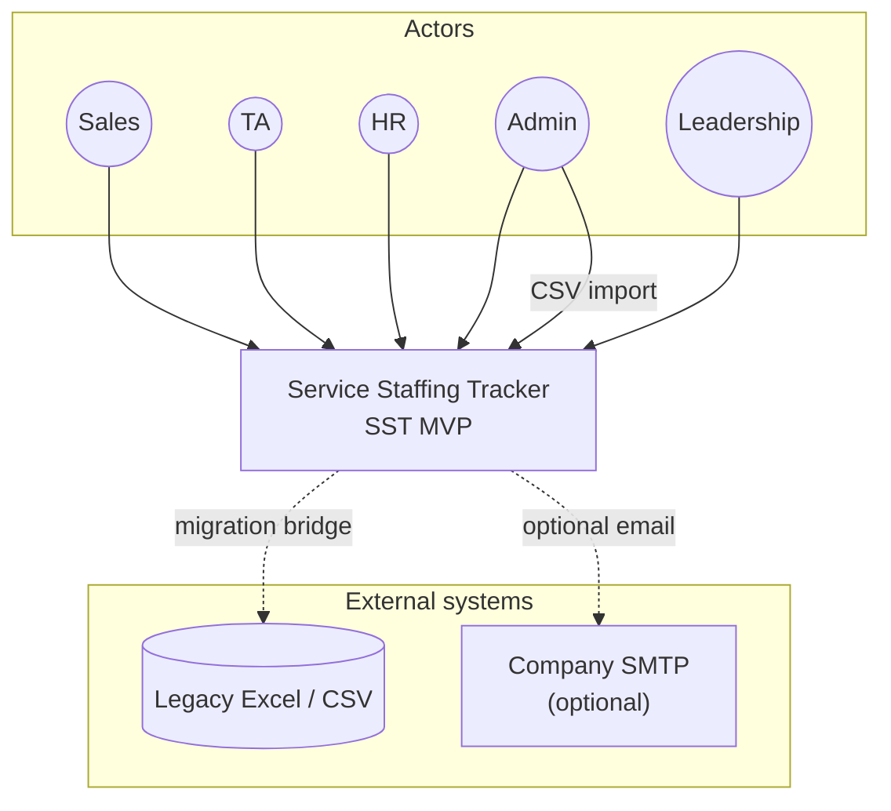
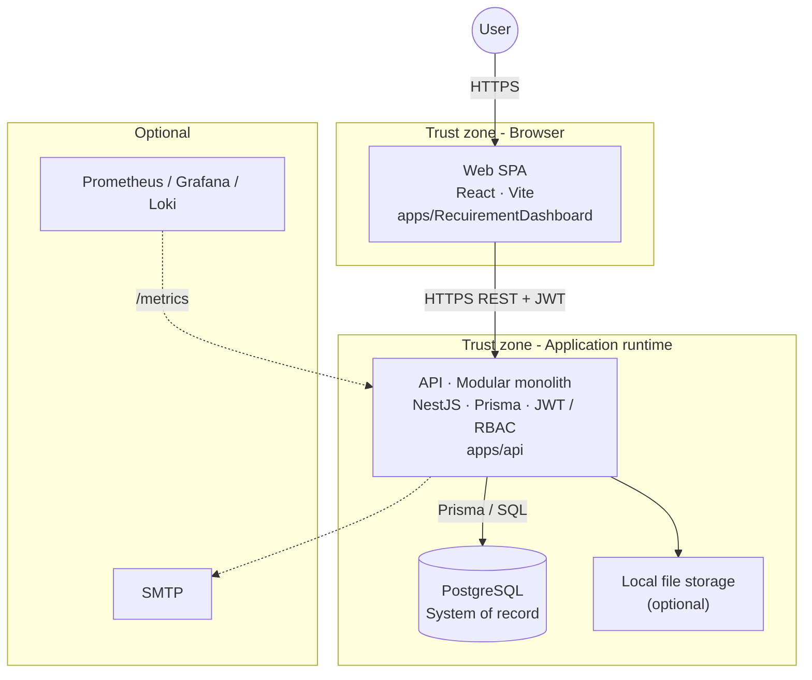
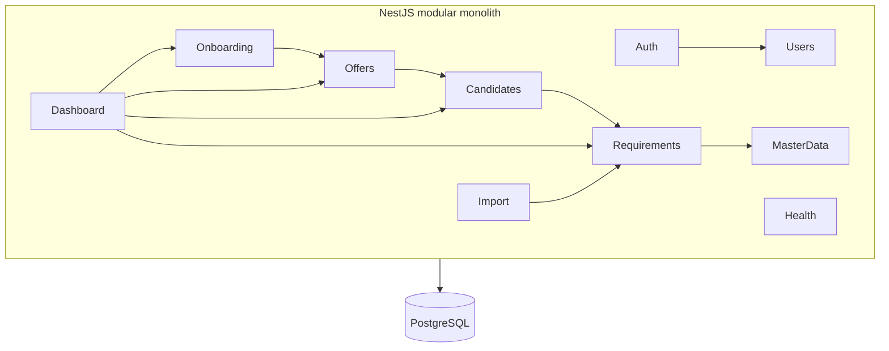

# C4 Model — SST

## Purpose

C4 views for shared architecture understanding. For presentation-ready, labeled enterprise boards, prefer **[ENTERPRISE_HIGH_LEVEL_DIAGRAMS.md](./ENTERPRISE_HIGH_LEVEL_DIAGRAMS.md)**.

## Audience

Engineers, architects.

## Scope

MVP context, containers, components. Code-level optional.

## Definitions

C4: Context, Container, Component, Code.

---

## Level 1 — Context

> Full version with captions: [ENTERPRISE_HIGH_LEVEL_DIAGRAMS.md — Fig 1](./ENTERPRISE_HIGH_LEVEL_DIAGRAMS.md#fig-1--system-context-c4-level-1)

## Level 2 — Containers

> Full version with ports and decisions: [ENTERPRISE_HIGH_LEVEL_DIAGRAMS.md — Fig 2](./ENTERPRISE_HIGH_LEVEL_DIAGRAMS.md#fig-2--container-architecture-c4-level-2--primary-hla)

| Container | Technology | Notes |
|-----------|------------|-------|
| Web SPA | React + Vite | `apps/RecuirementDashboard` · port 5173 |
| API | NestJS + Prisma | `apps/api` · port 3000 · `/api/v1` |
| Database | PostgreSQL 16 | System of record |
| Monitoring | Prom / Grafana / Loki | Optional |
| SMTP | Company SMTP | Optional |

## Level 3 — API components

> Full modular monolith board: [ENTERPRISE_HIGH_LEVEL_DIAGRAMS.md — Fig 4](./ENTERPRISE_HIGH_LEVEL_DIAGRAMS.md#fig-4--api-modular-monolith-c4-level-3)

## Level 3 — Web components

- `app` shell (router, auth provider, query client)  
- `features/*` (dashboard, requirements, candidates, offers, onboarding, admin)  
- `shared/ui`, `shared/api`, `shared/lib`  

## Code (illustrative)

`RequirementsService.create` → `RequirementsRepository.insert` → Prisma `requirement.create` → `AuditService.record`.

## References

- [ENTERPRISE_HIGH_LEVEL_DIAGRAMS.md](./ENTERPRISE_HIGH_LEVEL_DIAGRAMS.md) — **enterprise diagram pack (recommended)**  
- [BEGINNER_ARCHITECTURE_DIAGRAMS.md](./BEGINNER_ARCHITECTURE_DIAGRAMS.md) — beginner talk track  
- [BEGINNER_HIGH_LEVEL_ARCHITECTURE.md](./BEGINNER_HIGH_LEVEL_ARCHITECTURE.md)  
- [HIGH_LEVEL_ARCHITECTURE.md](./HIGH_LEVEL_ARCHITECTURE.md)  
- [SEQUENCE_DIAGRAMS.md](./SEQUENCE_DIAGRAMS.md)  
