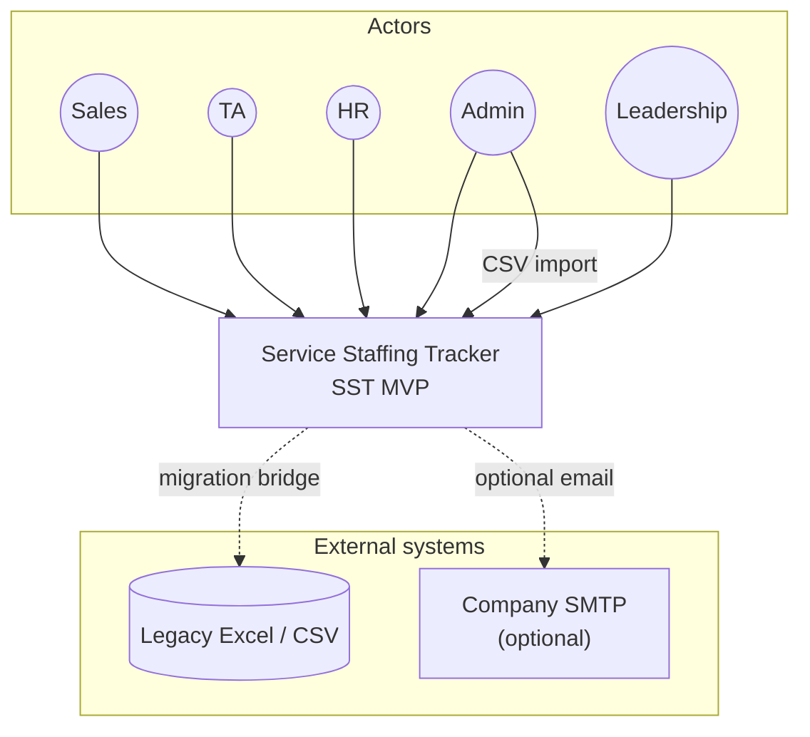
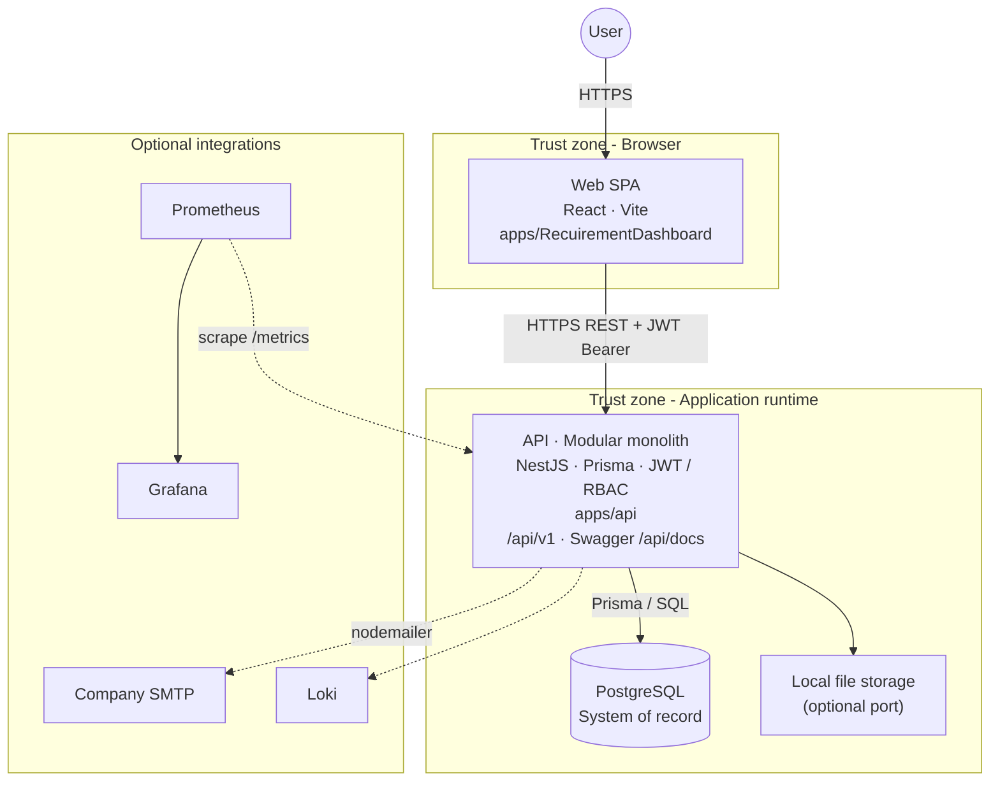
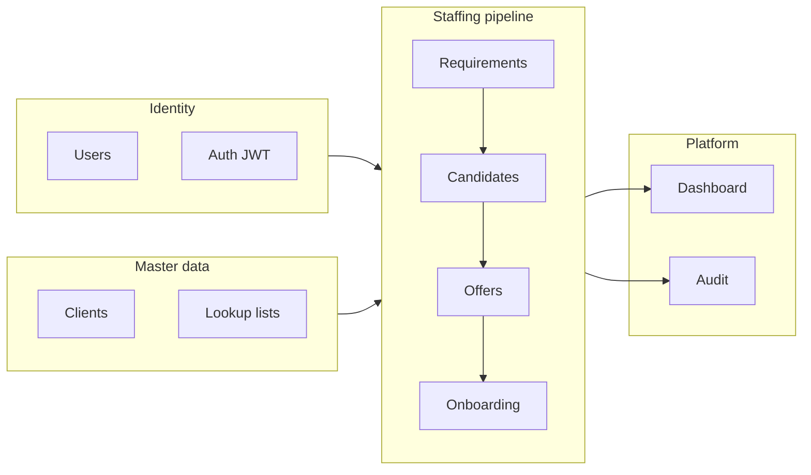
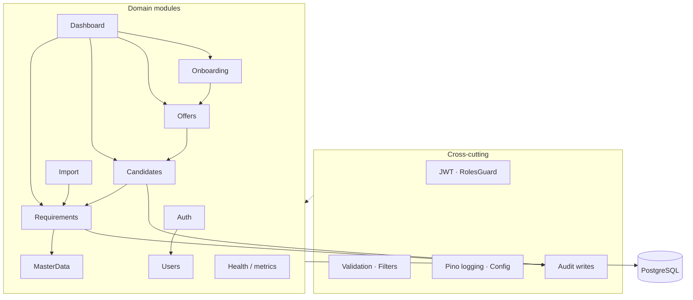
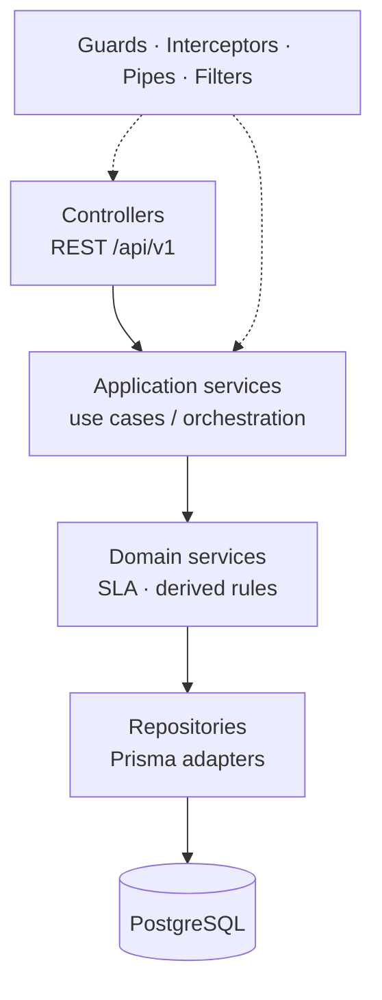
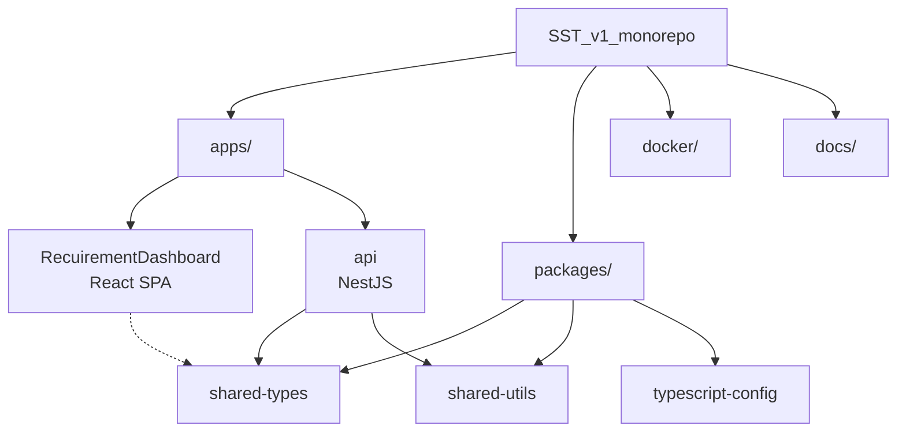
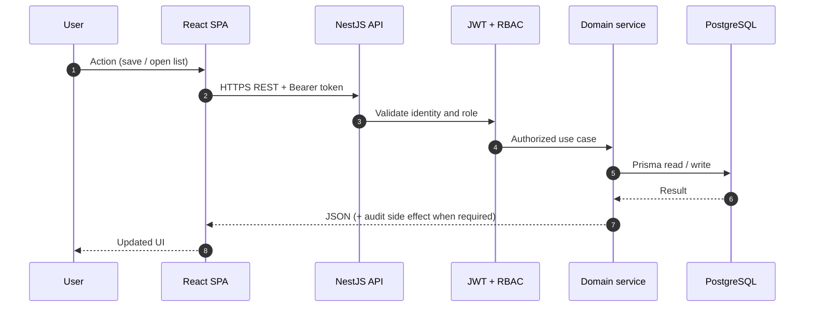
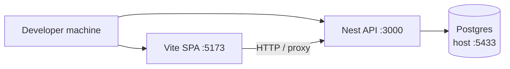
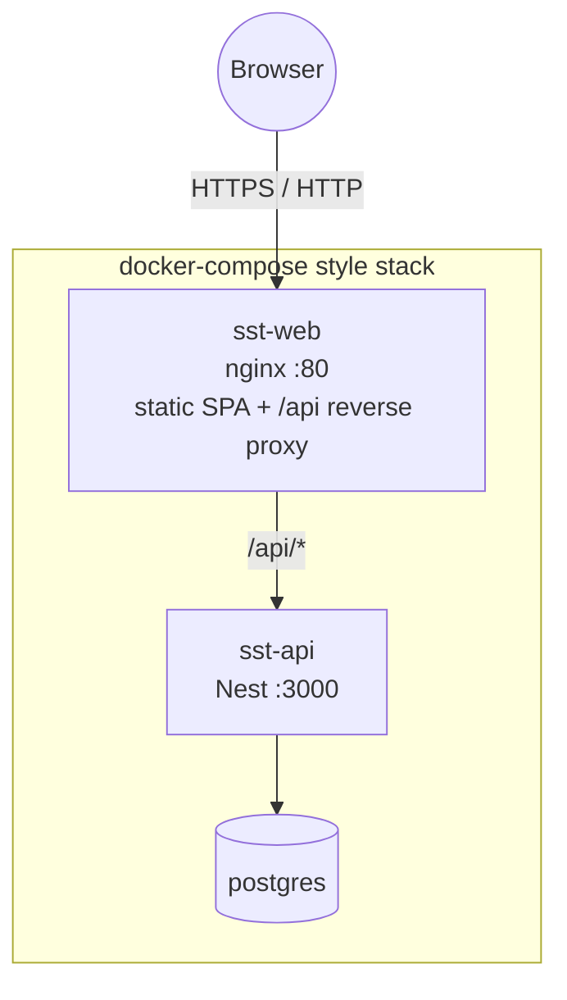

# Enterprise High-Level Architecture Diagrams — SST

## Purpose

Clean, enterprise-grade **visual pack** for Service Staffing Tracker (SST) MVP. Each figure has one zoom level, labeled edges, and a short caption for presentations or architecture reviews.

## Audience

Architects, Team Leads, senior engineers, DevOps, stakeholders who need a board-room-ready system view.

## Scope

**As-is MVP:** React SPA + NestJS modular monolith + PostgreSQL system of record.  
**Optional (dashed):** SMTP, Prometheus/Grafana/Loki.  
**Out of scope on these boards:** microservices, Redis as required runtime, BFF, SSO, cloud multi-region.

## How to use

| Figure | Zoom | Use when |
|-------|------|----------|
| Fig 1 | Context | Executive / product intro |
| Fig 2 | Containers | **Primary HLA** for engineering reviews |
| Fig 3 | Domain pipeline | Business architecture |
| Fig 4 | API components | Modular monolith seams |
| Fig 5 | API layers | Code structure / clean architecture |
| Fig 6 | Monorepo | Repo ownership |
| Fig 7 | Request path | Security & data path |
| Fig 8 | Deployment | Local vs Compose topology |

**Render:** GitHub / Cursor Mermaid preview, or paste into [mermaid.live](https://mermaid.live).

---

## Legend (apply to all figures)

| Element | Meaning |
|---------|---------|
| Solid arrow | Critical path dependency / control |
| Dashed arrow | Optional or migration path |
| Person node | Human role |
| Rounded box | Software system or process |
| Rectangle with tech subtitle | Deployable container / app |
| Cylinder | Data store |
| Grey / optional subgraph | Not required for core CRUD |

| Protocol shorthand | Meaning |
|--------------------|---------|
| HTTPS REST + JWT | JSON API with Bearer access token |
| Prisma/SQL | Nest API → PostgreSQL via Prisma |
| SMTP | Optional outbound mail |

---

## Fig 1 — System context (C4 Level 1)

**Caption:** SST sits between hiring roles and a small set of external systems. Users interact with one product surface; Excel is a migration/import bridge, not the live SoR.



| Actor | Primary interest |
|-------|------------------|
| Sales | Requirement intake and ownership |
| TA | Candidate pipeline and selection |
| HR | Offers and onboarding |
| Admin | Users, masters, import, audit |
| Leadership | Dashboards (typically read-only) |

---

## Fig 2 — Container architecture (C4 Level 2) — primary HLA

**Caption:** One SPA, one modular-monolith API, one PostgreSQL system of record. The SPA never talks to the database. Optional mail and observability sit beside the critical path.



| Container | Technology | Responsibility |
|-----------|------------|----------------|
| Web SPA | React, Vite, TanStack Query | Role-aware UI; calls API only |
| API | NestJS, Prisma, Passport/JWT | Business rules, RBAC, audit, OpenAPI |
| PostgreSQL | PostgreSQL 16 | Authoritative data (SoR) |
| Local files | Disk port | Attachments / local storage when used |
| SMTP / metrics | Optional | Mail and ops observability |

| Typical local ports | |
|---------------------|--|
| SPA | `5173` |
| API | `3000` (`/health`, `/api/docs`, `/api/v1/*`) |
| PostgreSQL | host often `5433` → container `5432` |

**Architectural decisions on this board**

| Decision | Statement |
|----------|-----------|
| Style | Modular monolith (not microservices) |
| Client integration | SPA → API directly (no BFF) |
| Integration style | Synchronous REST/JSON |
| Persistence | Single PostgreSQL SoR |

---

## Fig 3 — Business domain pipeline

**Caption:** Runtime architecture follows the hiring pipeline. Master data, identity, dashboard, and audit wrap the sequential staffing flow.



```text
Requirement → Candidates → Offer → Onboarding → Join / Close seats
```

---

## Fig 4 — API modular monolith (C4 Level 3)

**Caption:** One NestJS process, domain-bounded modules. Deploy once; keep module folders independent.



| Module group | Modules |
|--------------|---------|
| Access | Auth, Users |
| Catalog | MasterData |
| Pipeline | Requirements, Candidates, Offers, Onboarding |
| Insights | Dashboard |
| Platform | Import, Audit (cross-cutting), Health |

---

## Fig 5 — API logical layers (clean architecture)

**Caption:** HTTP is the edge; business rules live in services; persistence is isolated behind repositories.



```text
Controllers → Application services → Domain / pure calculators → Repositories (Prisma) → DB
```

---

## Fig 6 — Monorepo structure

**Caption:** One repository versions UI, API, shared contracts, Docker, and docs together (Turborepo + pnpm).



**Dependency rule:** apps depend on packages; apps do not import each other.

---

## Fig 7 — End-to-end request path (security + data)

**Caption:** Every protected business action is SPA → JWT/RBAC → service rules → Prisma → PostgreSQL. Dashboard and lists are the same path with read-focused services.



---

## Fig 8 — Deployment topology (MVP)

### 8a — Local development



### 8b — Production-style Docker Compose



---

## One-page summary board (combine for a poster)

Use **Fig 2** as the centerpiece, **Fig 3** as a strip under it, **Fig 1** actors on the left.

```text
┌─ Actors ─┐     ┌──────── Container HLA ────────┐     ┌─ Optional ─┐
│ Sales    │────▶│ SPA ──REST+JWT──▶ Nest API     │····▶│ SMTP      │
│ TA       │     │                    │           │····▶│ Metrics   │
│ HR       │     │                    ▼           │     └───────────┘
│ Admin    │     │              PostgreSQL (SoR)  │
│ Leader   │     └────────────────────────────────┘
└──────────┘
              Requirement → Candidate → Offer → Onboarding
```

**Poster footer (recommended wording):**

> **SST MVP High-Level Architecture.** A React SPA authenticates users and consumes a NestJS modular-monolith REST API protected by JWT and RBAC. The API persists staffing pipeline and master data via Prisma to PostgreSQL (system of record). Optional integrations: company SMTP and metrics scrape. No BFF, no microservice mesh, no required Redis in MVP.

---

## Accuracy notes (as-is)

| Topic | Use this |
|-------|----------|
| Web folder | `apps/RecuirementDashboard` |
| API folder | `apps/api` |
| Shared libs | `packages/shared-types`, `packages/shared-utils` |
| Core path | SPA → REST + JWT → Nest → Prisma → PostgreSQL |
| Optional | SMTP, Prometheus/Grafana/Loki |
| Not MVP runtime | Redis, WebSocket bus, BFF, microservices per domain |

---

## References

- [HIGH_LEVEL_ARCHITECTURE.md](./HIGH_LEVEL_ARCHITECTURE.md) — narrative HLA  
- [C4_MODEL.md](./C4_MODEL.md) — C4 index  
- [BEGINNER_HIGH_LEVEL_ARCHITECTURE.md](./BEGINNER_HIGH_LEVEL_ARCHITECTURE.md) — plain-language guide  
- [BEGINNER_ARCHITECTURE_DIAGRAMS.md](./BEGINNER_ARCHITECTURE_DIAGRAMS.md) — onboarding talk track  
- [SEQUENCE_DIAGRAMS.md](./SEQUENCE_DIAGRAMS.md)  
- ADR-0002 — modular monolith: [../14-standards/adr/0002-modular-monolith.md](../14-standards/adr/0002-modular-monolith.md)  
