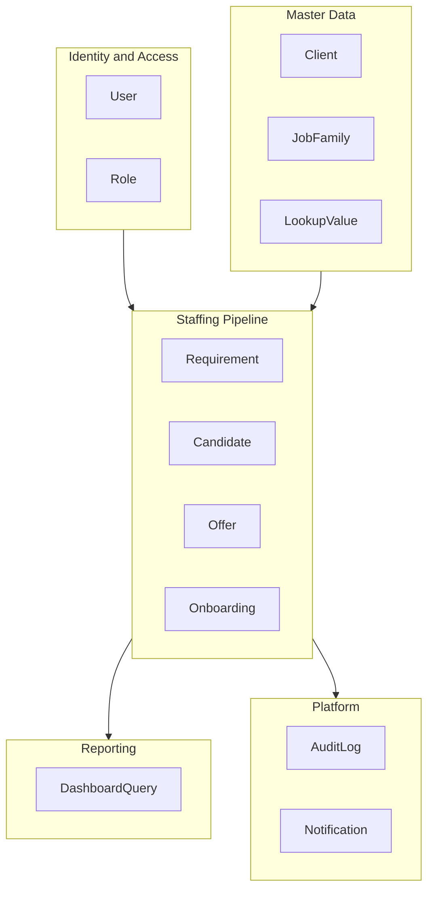
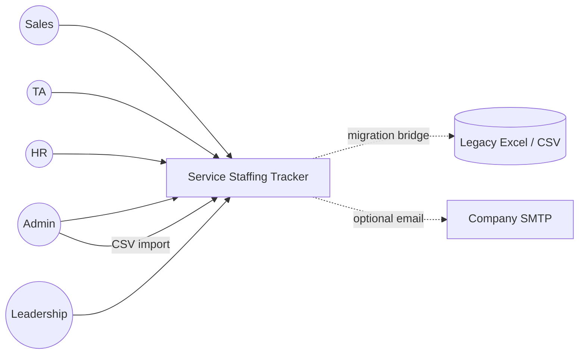
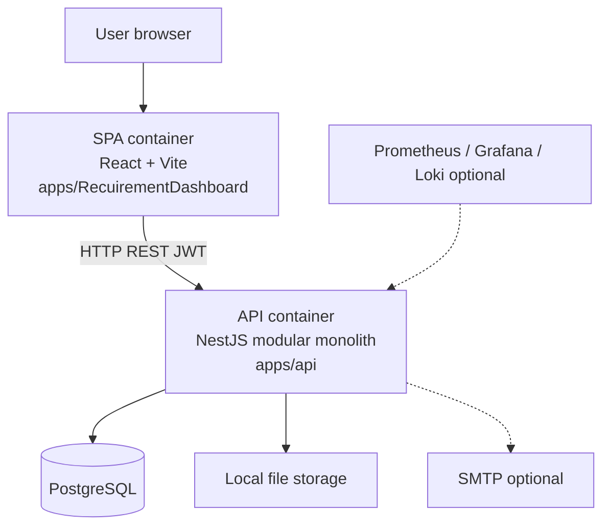

# Service Staffing Tracker — Engineering Overview

## Purpose

High-level engineering brief for leaders and senior contributors joining the **Service Staffing Tracker (SST)** program. It explains *what* the product is, *why* it exists, *how* the system is shaped, and *where* deeper specifications live.

This document is intentionally strategic. It does not replace detailed design, API contracts, or implementation handbooks.

## Audience

| Audience | How to use this guide |
|----------|------------------------|
| **Team Lead / Engineering Manager** (primary) | System context, ownership boundaries, decisions, risks, and doc map |
| Tech Lead / Architect | Entry point before C4, ADRs, and module design |
| Senior engineer (any stack) | Orientation before domain and API deep-dives |
| Product / Delivery partners | Shared language for scope and platform constraints |

**Hands-on NestJS implementers:** after this overview, use [21-guides/NESTJS_DEVELOPER_HANDBOOK.md](./21-guides/NESTJS_DEVELOPER_HANDBOOK.md).

**Beginner high-level architecture (plain language):** [06-system-design/BEGINNER_HIGH_LEVEL_ARCHITECTURE.md](./06-system-design/BEGINNER_HIGH_LEVEL_ARCHITECTURE.md).  

**Enterprise HLA diagrams (structured boards):** [06-system-design/ENTERPRISE_HIGH_LEVEL_DIAGRAMS.md](./06-system-design/ENTERPRISE_HIGH_LEVEL_DIAGRAMS.md).  

**Slides / whiteboard onboarding:** [06-system-design/BEGINNER_ARCHITECTURE_DIAGRAMS.md](./06-system-design/BEGINNER_ARCHITECTURE_DIAGRAMS.md).

## Document control

| Attribute | Value |
|-----------|--------|
| Product | Service Staffing Tracker (SST) |
| Classification | Internal engineering |
| Standards alignment | IEEE-style SRS/PRD set, C4 model, OWASP ASVS themes, 12-Factor ops mindset, ADR governance |
| Source of product truth | `docs/` tree (not tribal knowledge) |
| Legacy operational baseline | `Service_Staffing_Tracker_Updated Version.xlsx` |

---

## 1. Executive summary

### 1.1 One-sentence product definition

**SST** is the multi-user **system of record** for the service staffing *hiring pipeline*—digitizing the Excel workbook that tracks client requirements through TA pipeline, offer, onboarding, and operational dashboards.

### 1.2 North star

Reduce time-to-fill, eliminate spreadsheet fragility, and give **Sales**, **TA**, and **HR** shared real-time visibility with **authentication**, **role-based access**, and an **auditable mutation trail**.

### 1.3 What leaders own in this codebase

| Layer | Ownership expectation |
|-------|------------------------|
| Product fidelity | Excel process parity for pipeline + dashboard KPIs; no silent divergence from business rules |
| Architecture integrity | Modular monolith boundaries, clean module seams for future workforce domains |
| Security & compliance posture | JWT auth, RBAC matrix, audit logging, careful PII handling |
| Delivery quality | Shared types, test strategy, CI gates, observability hooks |
| Documentation discipline | Decisions recorded as ADRs; contracts live in `docs/10-api` and Prisma design |

### 1.4 Elevator architecture

```text
Browser (React SPA) ──REST + JWT──► NestJS API (modular monolith) ──Prisma──► PostgreSQL
                                              │
                                              ├── optional company SMTP
                                              └── optional /metrics (Prometheus)
```

There is **no** BFF, message bus, or microservices mesh in MVP. Complexity is managed through **module boundaries inside one API** and a **monorepo** with shared contracts.

---

## 2. Business context

### 2.1 Problem

Staffing demand and hiring progress are operated from a sophisticated Excel workbook. Spreadsheets do not provide:

- Safe concurrent multi-user editing  
- Authentication and least-privilege access  
- End-to-end audit of critical mutations  
- Reliable, filterable operational KPIs under real usage  
- A clean extension path into broader workforce domains (bench, capacity, assignments)

### 2.2 Outcomes the platform must deliver

| Goal | Priority | Engineering implication |
|------|----------|-------------------------|
| Replace Excel as SoR for the hiring pipeline | P0 | Full CRUD + import path for pipeline entities |
| Enforce stage workflows, ownership, SLAs | P0 | Server-side state rules; not UI-only validation |
| Real-time dashboards ≥ Excel parity | P0 | Deterministic aggregates; filterable read models |
| Auth, RBAC, audit logs | P0 | Guards/matrix on every mutating surface |
| Pluggable architecture for future modules | P0 (architecture) | Bounded contexts; no spaghetti Prisma access |
| Excel data migration fidelity | P0 | Import/export + RTM against sheets |
| Notifications / leadership export | P1 | Stubs or phased delivery; do not block SoR |

Full vision: [00-initiation/VISION.md](./00-initiation/VISION.md).  
Product detail: [03-prd/PRD.md](./03-prd/PRD.md).

### 2.3 Scope governance (MVP vs Future)

| In MVP | Explicitly Future (architected only) |
|--------|--------------------------------------|
| Requirement intake → TA candidates → Offer → Onboarding | Bench, Skills Matrix, Capacity |
| Master data / setup lists | Availability, Assignments, Workload |
| Dashboard KPIs + filters | Full ATS / recruiting suite |
| Auth (JWT), RBAC, audit, CSV import bridge | Cloud multi-region production layout |
| Docker-first local / on-prem style deploy path | SSO identity federation (planned later) |

**Governing ADR:** [14-standards/adr/0001-mvp-pipeline-first.md](./14-standards/adr/0001-mvp-pipeline-first.md).  
Future seams: [04-domain/FUTURE_MODULES.md](./04-domain/FUTURE_MODULES.md).

**Leadership rule:** do not expand MVP scope into workforce modules without an ADR and RTM update.

---

## 3. Domain overview (business language)

### 3.1 Hiring pipeline (core value stream)

```text
Requirement Intake  →  TA Candidate Pipeline  →  Offer & Selection  →  HR Onboarding
            │                      │                      │                    │
            └──────────────────────┴──────── Dashboard + Master Data ──────────┘
                                    Auth · RBAC · Audit
```

### 3.2 Excel → application mapping

| Excel area | Application capability |
|------------|------------------------|
| Requirement Intake | Requirements domain + API + UI |
| TA Candidate Pipeline | Candidates domain + API + UI |
| Offer & Selection | Offers domain + API + UI |
| HR Onboarding | Onboarding domain + API + UI |
| Setup Lists | Master data / admin |
| Dashboard | Aggregated KPIs + filters |

Traceability: [01-business-analysis/REQUIREMENT_TRACEABILITY_MATRIX.md](./01-business-analysis/REQUIREMENT_TRACEABILITY_MATRIX.md).

### 3.3 Bounded contexts



| Context | Responsibility |
|---------|----------------|
| Identity & Access | Users, credentials, roles, token lifecycle |
| Master Data | Clients, job families, configurable lists |
| Staffing Pipeline | Requirement → Candidate → Offer → Onboarding |
| Reporting | Read-model KPIs and filters (dashboard) |
| Platform | Audit trail, notification stubs, health/ops |

Domain model: [04-domain/DOMAIN_MODEL.md](./04-domain/DOMAIN_MODEL.md).

### 3.4 Non-negotiable business rules

Engineering must treat these as invariants (enforced on the server):

1. A **Candidate** always belongs to a **Requirement** (Req ID relationship).  
2. An **Offer** is created only when the candidate is **selected** and a valid Candidate ID exists.  
3. **Onboarding** starts only after Offer status = **Accepted**.  
4. Open/closed position counts derive from `Number Of Positions` and selection/join outcomes—not free-typed contradictions.  
5. Duplicate **mobile/email** detection is server-enforced.  
6. **SLA RAG** for TA handoff follows defined thresholds (e.g. ≤2 days Green, ≤5 Amber, else Red when handoff empty—see full formula in business rules).  
7. Prefer **soft-delete**; mutations flow through audit-aware services.

Full catalog: [01-business-analysis/BUSINESS_RULES.md](./01-business-analysis/BUSINESS_RULES.md).

---

## 4. Personas, roles, and access model

### 4.1 Operating roles (MVP)

| Role | Operational charter |
|------|---------------------|
| `ADMIN` | Users, master data, import, full operational override surface |
| `SALES` | Create/update requirements; pipeline visibility appropriate to ownership |
| `TA` | Candidates, selection, TA-side requirement fields; pipeline integrity |
| `HR` | Offers after selection; onboarding through join |
| `LEADERSHIP_READONLY` | Dashboards and reporting views only |

Permission source of truth: [11-security/PERMISSION_MATRIX.md](./11-security/PERMISSION_MATRIX.md).  
Auth design: [11-security/AUTH_RBAC.md](./11-security/AUTH_RBAC.md).

### 4.2 Security posture (enterprise expectations)

| Concern | MVP approach |
|---------|--------------|
| Authentication | Email/password; JWT access + refresh |
| Authorization | Role guards on API; matrix-driven capability checks |
| Audit | Critical mutations written to audit log |
| Secrets | Env-based config; no secrets in repo |
| Transport | HTTPS in deployed environments; CORS constrained |
| Threat awareness | OWASP themes for injection, broken access control, sensitive data |

OWASP / secrets guidance: [11-security/OWASP_AND_SECRETS.md](./11-security/OWASP_AND_SECRETS.md).  
Audit detail: [11-security/AUDIT_LOGGING.md](./11-security/AUDIT_LOGGING.md).

---

## 5. Solution architecture

### 5.1 Architecture style

| Decision | Choice | Rationale |
|----------|--------|-----------|
| Deployment topology | **Modular monolith** API + SPA | Delivery speed, coherent transactions, simple ops |
| Repo strategy | **Turborepo + pnpm monorepo** | Version UI, API, shared contracts together |
| Integration style | **Sync REST/JSON** | Matches Excel CRUD mental model |
| Persistence | **PostgreSQL** single source of truth | Strong consistency for pipeline workflows |
| Client architecture | **React SPA** talks API directly (no BFF) | Less indirection; shared Zod/types package reduces drift |
| Evolution path | Module folders + ports for cache/storage | Extract services only when scale or team topology requires it |

Governing ADR: [14-standards/adr/0002-modular-monolith.md](./14-standards/adr/0002-modular-monolith.md).  
HLA: [06-system-design/HIGH_LEVEL_ARCHITECTURE.md](./06-system-design/HIGH_LEVEL_ARCHITECTURE.md).  
Diagrams: [06-system-design/ENTERPRISE_HIGH_LEVEL_DIAGRAMS.md](./06-system-design/ENTERPRISE_HIGH_LEVEL_DIAGRAMS.md).  
C4: [06-system-design/C4_MODEL.md](./06-system-design/C4_MODEL.md).

### 5.2 Context diagram (C4 Level 1)



### 5.3 Container diagram (C4 Level 2)



| Container | Technology | Primary responsibility |
|-----------|------------|------------------------|
| SPA | React, Vite, TanStack Query, React Router | Role-aware UI, dense table-first operations |
| API | NestJS, Prisma, Passport/JWT, Swagger | Domain rules, RBAC, audit, integrations |
| Database | PostgreSQL | System of record |
| Observability (optional stack) | Prometheus, Grafana, Loki | Metrics, dashboards, log aggregation |

### 5.4 API logical layering

```text
HTTP Controllers
        ↓
Application services (orchestration, use cases)
        ↓
Domain services / pure calculators (SLA, derived fields)
        ↓
Repositories (Prisma adapters)
        ↓
PostgreSQL

Cross-cutting: Guards · Interceptors · Pipes · Filters · Config · Structured logging
```

Backend structure: [08-backend/NESTJS_ARCHITECTURE.md](./08-backend/NESTJS_ARCHITECTURE.md).  
Module catalog: [08-backend/MODULE_CATALOG.md](./08-backend/MODULE_CATALOG.md).

### 5.5 Frontend shape

- Feature-first modules aligned to pipeline domains  
- Server state via TanStack Query; auth/session aware routing  
- Validation aligned with shared schemas where packages expose them  
- UX principle: dense, table-first, Excel-familiar; destructive actions confirmed  

Frontend architecture: [09-frontend/FRONTEND_ARCHITECTURE.md](./09-frontend/FRONTEND_ARCHITECTURE.md).

### 5.6 Explicit non-goals in runtime topology (MVP)

The following are **not** part of the shipped product shape unless re-decisioned:

- Microservices per domain  
- Redis as a required runtime (ports may exist later)  
- WebSocket / MQTT real-time bus  
- Mobile or desktop agents  
- Dedicated BFF tier  

---

## 6. Repository and platform layout

### 6.1 Monorepo (as operated)

```text
/
├── apps/
│   ├── api/                      # NestJS API (@sst/api)
│   └── RecuirementDashboard/     # React SPA (Vite)
├── packages/
│   ├── shared-types/             # Shared Zod schemas / DTO contracts
│   ├── shared-utils/             # Pure helpers (dates, RAG, etc.)
│   └── typescript-config/        # Shared TS config
├── docker/                       # Compose, monitoring configs
├── docs/                         # Enterprise documentation SoR
├── turbo.json
├── pnpm-workspace.yaml
└── package.json
```

Workspace detail: [13-monorepo/MONOREPO_STRUCTURE.md](./13-monorepo/MONOREPO_STRUCTURE.md).  
Packages policy: [13-monorepo/PACKAGES_AND_SHARED_LIBS.md](./13-monorepo/PACKAGES_AND_SHARED_LIBS.md).

### 6.2 Technology baseline

| Area | Stack |
|------|--------|
| Tooling | Turborepo, pnpm, TypeScript |
| Frontend | React, Vite, Tailwind, ShadCN patterns, TanStack Query, React Router, RHF, Zod, Axios |
| Backend | NestJS, Prisma, PostgreSQL, Passport/JWT, class-validator, Swagger/OpenAPI, Pino |
| Delivery | Docker Compose, GitHub Actions, seed/migrate scripts |
| Observability | Health endpoints, Prometheus metrics path, optional Grafana/Loki stack |

### 6.3 Convention ports (local)

| Service | Port (typical) |
|---------|----------------|
| Web (Vite) | 5173 |
| API (Nest) | 3000 (`/api/v1`, Swagger `/api/docs`) |
| PostgreSQL | 5432 in container; host may map (e.g. 5433) |
| Redis (future) | 6379 |
| Prometheus | 9090 |
| Grafana | 3001 |
| Loki | 3100 |

Local runbooks: [17-local-deployment/LOCAL_SETUP.md](./17-local-deployment/LOCAL_SETUP.md), [17-local-deployment/DOCKER_COMPOSE.md](./17-local-deployment/DOCKER_COMPOSE.md).

### 6.4 Data platform

| Topic | Standard |
|-------|----------|
| ORM / migrations | Prisma |
| Design artifacts | ER + Prisma design docs under `07-database` |
| Soft delete | Preferred for domain entities |
| Audit coupling | Mutation path writes audit records for critical actions |
| Backup / migrate | Documented under migration/backup guidance |

Start with: [07-database/PRISMA_DESIGN.md](./07-database/PRISMA_DESIGN.md), [07-database/ER_AND_SCHEMA.md](./07-database/ER_AND_SCHEMA.md).

---

## 7. Cross-cutting engineering standards

### 7.1 Principles

| Principle | Application in SST |
|-----------|--------------------|
| KISS / YAGNI | No workforce modules in MVP implementations |
| Clean / layered architecture | Controllers do not own business rules; repositories do not own workflow policy |
| Feature modularity | Backend Nest modules and frontend features mirror domain language |
| Secure by default | AuthZ on mutating APIs; least privilege by role |
| Contract-first discipline | API catalog + OpenAPI; shared types reduce SPA/API drift |
| Observable by default | Structured logs, health/ready, metrics scrape path |
| Documented decisions | Material architecture choices become ADRs |

Coding standards: [14-standards/CODING_STANDARDS.md](./14-standards/CODING_STANDARDS.md).  
Git / PR: [14-standards/GIT_AND_PR.md](./14-standards/GIT_AND_PR.md).

### 7.2 API product standards

- Versioned REST under `/api/v1`  
- Swagger at `/api/docs`  
- Consistent error envelope, pagination, and filtering conventions  
- OpenAPI alignment for consumer tooling  

Catalog: [10-api/API_CATALOG.md](./10-api/API_CATALOG.md).  
Errors/pagination: [10-api/ERRORS_PAGINATION_FILTERING.md](./10-api/ERRORS_PAGINATION_FILTERING.md).  
OpenAPI conventions: [10-api/OPENAPI_CONVENTIONS.md](./10-api/OPENAPI_CONVENTIONS.md).

### 7.3 Quality engineering

| Layer | Expectation |
|-------|-------------|
| Strategy | Risk-based coverage across authz, pipeline state machine, dashboard fidelity |
| Structure | Unit + integration + catalog-driven end-to-end/UAT suites under `15-testing` |
| CI | Lint, typecheck, tests, build as release gates |
| Regression mind-set | RTM + v1 test catalog map features to verification |

Strategy: [15-testing/TESTING_STRATEGY.md](./15-testing/TESTING_STRATEGY.md).  
CI: [16-cicd/GITHUB_ACTIONS.md](./16-cicd/GITHUB_ACTIONS.md).  
Release/rollback: [16-cicd/RELEASE_AND_ROLLBACK.md](./16-cicd/RELEASE_AND_ROLLBACK.md).

### 7.4 Observability & operations

| Concern | MVP stance |
|---------|------------|
| Health | `/health`, readiness semantics |
| Metrics | Prometheus-compatible scrape endpoint |
| Logging | Structured (Pino) application logs |
| Support / DR | Documented under maintenance/incident guidance |
| Cloud trajectory | Planned separately; not a prerequisite for modular monolith correctness |

Observability: [18-monitoring/OBSERVABILITY.md](./18-monitoring/OBSERVABILITY.md).  
Cloud trajectory: [19-cloud/CLOUD_MIGRATION_PLAN.md](./19-cloud/CLOUD_MIGRATION_PLAN.md).  
Support/DR: [20-maintenance/SUPPORT_DR_INCIDENT.md](./20-maintenance/SUPPORT_DR_INCIDENT.md).

---

## 8. Delivery model and milestones

### 8.1 Capability milestones (product slicing)

| Milestone | Outcome |
|-----------|---------|
| M1 | Auth, users, master data, requirements |
| M2 | Candidates, selection, duplicate detection |
| M3 | Offers, onboarding |
| M4 | Dashboard, import, observability, CI hardening |

Planning: [12-planning/SPRINT_AND_MILESTONES.md](./12-planning/SPRINT_AND_MILESTONES.md), [12-planning/TEAM_SPRINT_PLAN.md](./12-planning/TEAM_SPRINT_PLAN.md).  
Epics/stories: [12-planning/EPICS_AND_STORIES.md](./12-planning/EPICS_AND_STORIES.md).

### 8.2 Dependency mindset

Pipeline entities are ordered by business causality:

```text
Master Data + Users/Auth
        → Requirements
            → Candidates (selection)
                → Offers
                    → Onboarding
Dashboard and import can mature in parallel once core entities exist, but KPI correctness depends on stable write paths.
```

Dependency graph: [12-planning/DEPENDENCY_GRAPH.md](./12-planning/DEPENDENCY_GRAPH.md).

---

## 9. Assumptions and open decision defaults

Until explicitly re-decisioned (prefer an ADR):

| Topic | Default |
|-------|---------|
| Tenancy | Single-tenant internal deployment |
| Identity | Email/password; SSO later |
| Notifications | In-app stub first; email via SMTP optional |
| File storage | Local disk behind a storage port |
| Cache / Redis | Interface-ready; not required for core MVP logic |
| Production cloud | Out of MVP critical path; see `19-cloud` |

---

## 10. Documentation map (enterprise knowledge architecture)

Documentation is organized as a progressive enterprise set. Use this map to route the team instead of rediscovering structure.

| Folder | Content charter |
|--------|-----------------|
| `00-initiation` | Vision, project charter |
| `01-business-analysis` | FRs, NFRs, rules, personas, workflows, RTM |
| `02-srs` | IEEE-style software requirements |
| `03-prd` | Product requirements and success criteria |
| `04-domain` | Domain model, processes, future modules |
| `05-ux` | IA, flows, wireframes, design system |
| `06-system-design` | HLA, C4, sequences, data flow, deploy/scale, beginner diagrams |
| `07-database` | ER, Prisma, indexes/audit, migrations |
| `08-backend` | Nest architecture, modules, cross-cutting |
| `09-frontend` | SPA architecture, features, auth/routing, state |
| `10-api` | Endpoint catalog, OpenAPI, error/pagination standards |
| `11-security` | Auth/RBAC, permission matrix, OWASP, audit |
| `12-planning` | Epics, sprints, dependencies |
| `13-monorepo` | Workspace structure, packages, env/versioning |
| `14-standards` | Coding, Git/PR, ADRs |
| `15-testing` | Strategy, structure, v1 catalog |
| `16-cicd` | Pipelines, release and rollback |
| `17-local-deployment` | Local setup, Compose, seed/migrate |
| `18-monitoring` | Observability and alerts |
| `19-cloud` | Future cloud migration plan |
| `20-maintenance` | Support, DR, incident |
| `21-guides` | Admin/user manuals, FAQ, NestJS handbook |

Index: [README.md](./README.md).

### 10.1 “Where do I look?” quick index

| Question | Document |
|----------|----------|
| Why does this product exist? | [00-initiation/VISION.md](./00-initiation/VISION.md) |
| What must ship in MVP? | [03-prd/PRD.md](./03-prd/PRD.md) |
| Field meaning vs Excel | [01-business-analysis/REQUIREMENT_TRACEABILITY_MATRIX.md](./01-business-analysis/REQUIREMENT_TRACEABILITY_MATRIX.md) |
| Business invariants | [01-business-analysis/BUSINESS_RULES.md](./01-business-analysis/BUSINESS_RULES.md) |
| System shape (beginner) | [06-system-design/BEGINNER_HIGH_LEVEL_ARCHITECTURE.md](./06-system-design/BEGINNER_HIGH_LEVEL_ARCHITECTURE.md) |
| System shape (architect) | [06-system-design/HIGH_LEVEL_ARCHITECTURE.md](./06-system-design/HIGH_LEVEL_ARCHITECTURE.md) |
| Enterprise HLA diagrams | [06-system-design/ENTERPRISE_HIGH_LEVEL_DIAGRAMS.md](./06-system-design/ENTERPRISE_HIGH_LEVEL_DIAGRAMS.md) |
| Presentable diagrams | [06-system-design/BEGINNER_ARCHITECTURE_DIAGRAMS.md](./06-system-design/BEGINNER_ARCHITECTURE_DIAGRAMS.md) |
| Sequence of operations | [06-system-design/SEQUENCE_DIAGRAMS.md](./06-system-design/SEQUENCE_DIAGRAMS.md) |
| Endpoint contract | [10-api/API_CATALOG.md](./10-api/API_CATALOG.md) |
| Schema | [07-database/PRISMA_DESIGN.md](./07-database/PRISMA_DESIGN.md) |
| Who can do what? | [11-security/PERMISSION_MATRIX.md](./11-security/PERMISSION_MATRIX.md) |
| Local bootstrap fail | [21-guides/TROUBLESHOOTING_AND_FAQ.md](./21-guides/TROUBLESHOOTING_AND_FAQ.md) |

---

## 11. Recommended onboarding path (Team Lead)

| Phase | Focus | Primary reading |
|-------|--------|-----------------|
| **Day 1 — Product & domain** | Problem, MVP boundary, pipeline language | This guide §§1–4; Vision; PRD summary; Business rules |
| **Day 2 — Architecture** | Containers, layers, monorepo seams, ADRs | HLA; C4; ADR-0001/0002; Beginner architecture diagrams |
| **Day 3 — Security & data** | Roles, audit, Prisma/ER, non-negotiable invariants | AUTH_RBAC; Permission matrix; Prisma design |
| **Day 4 — Delivery system** | API surface, testing catalog, CI/CD, local runtime | API catalog; Testing strategy; Local setup / Compose |
| **Day 5 — Operating cadence** | Backlog structure, ownership, standards enforcement | Team sprint plan; Coding + Git/PR standards; Maintenance/incident |

**Then assign specialists:**

- Backend: NestJS architecture + module catalog + Nest handbook  
- Frontend: Frontend architecture + feature modules + auth/routing  
- QA: Testing strategy + v1 catalog + RTM  

---

## 12. Leadership checklist (first 30 days)

Use this as a governance checklist—not a developer task board.

- [ ] Confirm MVP boundary with Product (pipeline-first; workforce Future-only)  
- [ ] Walk pipeline happy path: requirement → candidate select → offer accepted → onboarding  
- [ ] Validate RBAC matrix against real operator roles (Sales / TA / HR / Admin / Leadership)  
- [ ] Review Prisma model vs Excel RTM for critical field fidelity  
- [ ] Confirm audit coverage on destructive and stage-transition mutations  
- [ ] Ensure CI gates (lint, typecheck, test, build) are required for merge  
- [ ] Verify local Docker path is reproducible for onboarding new engineers  
- [ ] Align team on ADR process for any topology or scope change  
- [ ] Identify top technical risks (data import fidelity, SLA formula parity, dashboard correctness)  
- [ ] Align support expectations (who owns production incidents when deployed)

---

## 13. Engineering implementation checklist (MVP reference)

Capability checklist for delivery tracking (detail lives in planning and testing docs):

- [ ] Turborepo + pnpm workspace with shared packages  
- [ ] PostgreSQL + Prisma schema per `07-database`  
- [ ] Nest modules: Auth, Users, MasterData, Requirements, Candidates, Offers, Onboarding, Dashboard, Audit, Import, Health  
- [ ] JWT access + refresh; guards; RBAC from permission matrix  
- [ ] React app: login, shell layout, feature routes, TanStack Query  
- [ ] Dashboard KPIs parity with Excel filters  
- [ ] Seed + CSV import bridge for migration  
- [ ] Docker Compose: api, web, postgres, optional monitoring  
- [ ] CI: lint, typecheck, unit/integration, build  
- [ ] Swagger at `/api/docs`  
- [ ] Health, readiness, metrics scrape endpoint  

---

## References

| Artifact | Link |
|----------|------|
| Docs index | [README.md](./README.md) |
| Vision | [00-initiation/VISION.md](./00-initiation/VISION.md) |
| PRD | [03-prd/PRD.md](./03-prd/PRD.md) |
| High-level architecture (beginner) | [06-system-design/BEGINNER_HIGH_LEVEL_ARCHITECTURE.md](./06-system-design/BEGINNER_HIGH_LEVEL_ARCHITECTURE.md) |
| High-level architecture (architect) | [06-system-design/HIGH_LEVEL_ARCHITECTURE.md](./06-system-design/HIGH_LEVEL_ARCHITECTURE.md) |
| Enterprise HLA diagrams | [06-system-design/ENTERPRISE_HIGH_LEVEL_DIAGRAMS.md](./06-system-design/ENTERPRISE_HIGH_LEVEL_DIAGRAMS.md) |
| Beginner architecture diagrams | [06-system-design/BEGINNER_ARCHITECTURE_DIAGRAMS.md](./06-system-design/BEGINNER_ARCHITECTURE_DIAGRAMS.md) |
| NestJS implementation handbook | [21-guides/NESTJS_DEVELOPER_HANDBOOK.md](./21-guides/NESTJS_DEVELOPER_HANDBOOK.md) |
| ADR-0001 MVP pipeline-first | [14-standards/adr/0001-mvp-pipeline-first.md](./14-standards/adr/0001-mvp-pipeline-first.md) |
| ADR-0002 Modular monolith | [14-standards/adr/0002-modular-monolith.md](./14-standards/adr/0002-modular-monolith.md) |

---

*When this guide and a deeper specification disagree on intentional detail, the specialized document in the relevant folder (domain, API, security, database) is authoritative; raise a doc fix PR rather than encoding conflicting folklore.*
