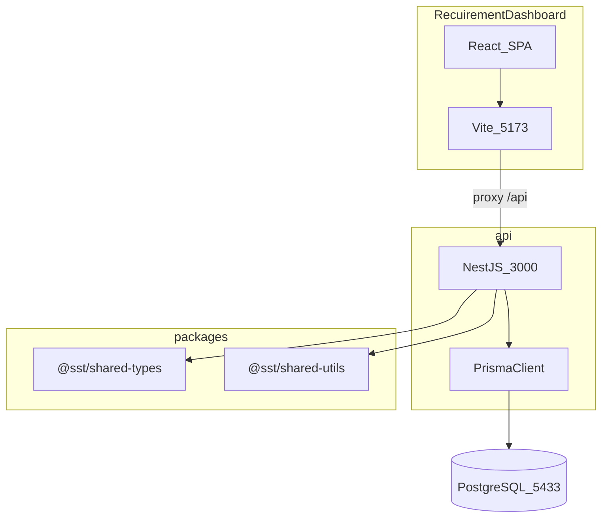
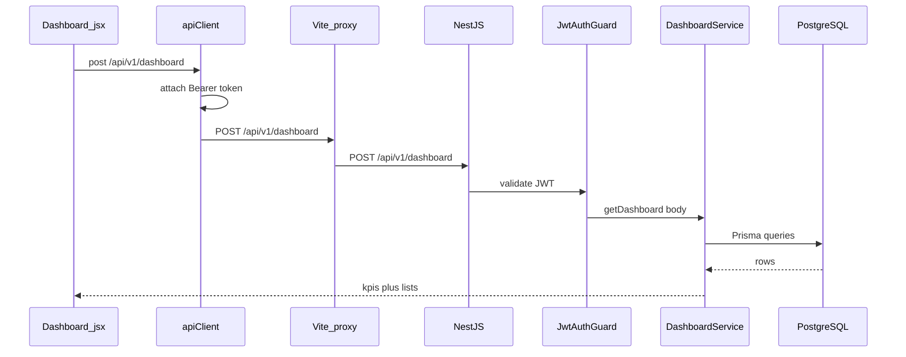
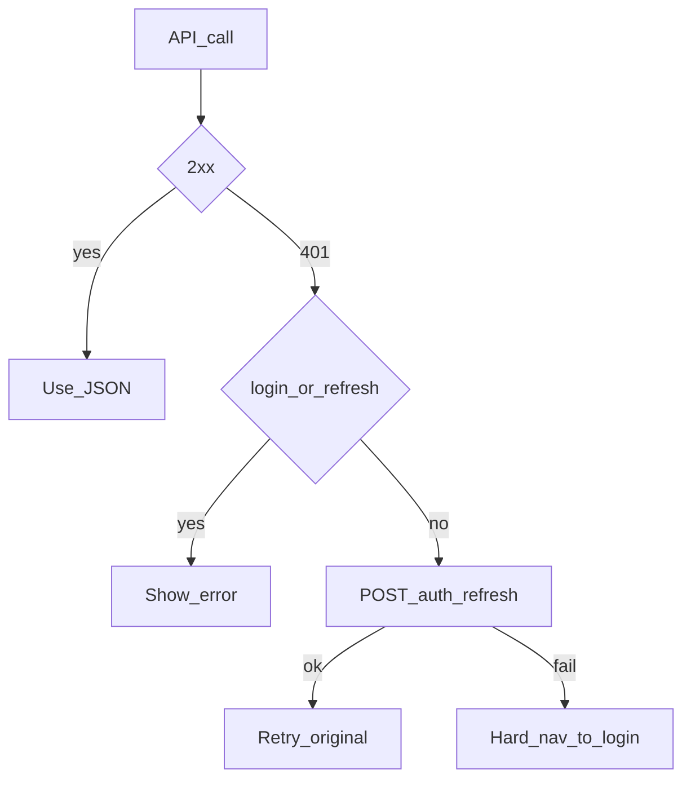
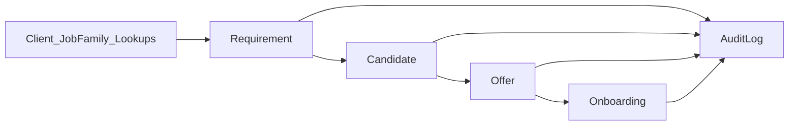
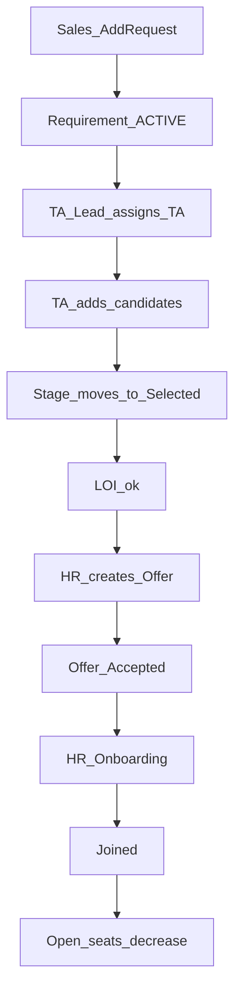
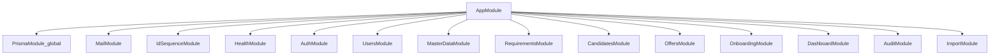

# SST codebase flow — beginner one-stop

This file walks the **live** Service Staffing Tracker (SST) repo as it exists today. Read it top to bottom the first time. After that, use the table of contents and the [Where do I look?](#11-where-do-i-look) index.

It is a **code walkthrough**, not a replacement for the rest of `docs/`. Product intent, ADRs, test catalogs, and deploy runbooks stay in their folders. Links at the end of each section point there.

**What you will be able to answer after this doc**

- What the product does, in one sentence
- Which folder is the UI vs the API vs shared libraries
- What happens when you click Login
- Why there are only two React routes (`/login`, `/dashboard`)
- How a hiring request becomes a joined candidate
- How NestJS modules, Prisma, and the SPA talk to each other

---

## Table of contents

1. [What SST is](#1-what-sst-is)
2. [How to run it locally](#2-how-to-run-it-locally)
3. [Monorepo map](#3-monorepo-map)
4. [One request, end to end](#4-one-request-end-to-end)
5. [Frontend boot](#5-frontend-boot)
6. [Auth in depth](#6-auth-in-depth)
7. [Who sees which tab](#7-who-sees-which-tab)
8. [Hiring pipeline](#8-hiring-pipeline)
9. [Backend modules](#9-backend-modules)
10. [Shared packages and tests](#10-shared-packages-and-tests)
11. [Where do I look?](#11-where-do-i-look)

---

## 1. What SST is

SST is a **multi-user hiring pipeline** that replaced a shared Excel workbook. Sales opens a client requirement, Talent Acquisition (TA) sources candidates, HR manages offers and joining. Everyone looks at the same PostgreSQL database instead of overwriting a spreadsheet.

The UI you open in the browser is the React app in `apps/RecuirementDashboard` (the folder name is a historical spelling of “Recruitment”). The API is NestJS in `apps/api`.

### Glossary

| Term | Meaning |
|------|---------|
| **SST** | Service Staffing Tracker — this product |
| **TA** | Talent Acquisition (recruiters). Backend role `TA` is the TA Owner; `TA_LEAD` is the TA Lead |
| **SPOC** | Client single point of contact. “Submitted to SPOC” is the first pipeline column |
| **RAG** | Red / Amber / Green SLA colour on how long a requirement waited for TA handoff |
| **Requirement** | A client ask: “we need N people for this role.” Public ID looks like `REQ-00001` |
| **Candidate** | A person sourced against one requirement. Public ID `CAN-00001` |
| **Offer** | Created after a candidate is selected (and LOI rules pass). Public ID `OFF-00001` |
| **Onboarding** | HR track after an offer is accepted. Public ID `ONB-00001` |
| **LOI** | Letter of Intent. Offer is blocked until LOI is `NOT_APPLICABLE` or `RECEIVED` |
| **Lookup** | Admin-seeded dropdown values (priority, offer status, BGV, …) stored in `lookup_types` / `lookup_values` |
| **Public ID** | Human-readable ID (`REQ-00001`). Internal primary keys are UUIDs |
| **MVP** | What is built now: pipeline + auth + audit. Bench/skills/capacity are future |

### Roles (database vs UI)

Prisma stores seven roles. The SPA maps them to `userType` strings used for tabs.

| Prisma `Role` | SPA `userType` | Typical job |
|---------------|----------------|-------------|
| `ADMIN` | `admin` | Everything, plus Users |
| `SALES` | `sales` | Create requirements, watch own pipeline |
| `SALES_LEAD` | `sales_lead` | Same screens as Sales |
| `TA` | `ta_owner` | Work assigned requirements: add candidates |
| `TA_LEAD` | `ta_lead` | Assign TAs to requirements, plus Assign Task |
| `HR` | `hr` | Offers and onboarding |
| `HR_LEAD` | `hr_lead` | Same screens as HR |

The SPA also defines `onboarding` as a `userType`. There is **no** `ONBOARDING` value on the Prisma `Role` enum. Treat `onboarding` as a UI alias; live users come from the seven roles above.

Further reading: [01-business-analysis/WORKFLOWS.md](./01-business-analysis/WORKFLOWS.md), [04-domain/DOMAIN_MODEL.md](./04-domain/DOMAIN_MODEL.md).

---

## 2. How to run it locally

From the repo root (see also the root [README.md](../README.md)):

```bash
cp .env.example .env
docker compose -f docker/docker-compose.yml up -d postgres
pnpm install
pnpm --filter @sst/shared-types build
pnpm --filter @sst/shared-utils build
pnpm --filter @sst/api prisma:generate
pnpm --filter @sst/api exec prisma migrate dev --name init
pnpm --filter @sst/api prisma:seed
pnpm dev
```

| Piece | URL / port |
|-------|------------|
| Web (Vite) | http://localhost:5173 |
| API | http://localhost:3000 |
| Health | http://localhost:3000/health |
| Swagger | http://localhost:3000/api/docs |
| Postgres | host port **5433** (avoids clashing with a local Postgres on 5432) |

`pnpm dev` runs Turbo, which starts both `@sst/api` and `@sst/RecuirementDashboard` (package names are in each app’s `package.json`).

**Admin login is not hardcoded.** Seed reads `SEED_ADMIN_EMAIL` and `SEED_ADMIN_PASSWORD` from `.env`. If those are missing, `apps/api/prisma/seed.ts` throws.

**Shared packages first.** The API imports `@sst/shared-types` and `@sst/shared-utils` from their `dist/` folders. If you skip the two `build` steps, Nest may fail to resolve those packages.

**Email is optional.** If `SMTP_HOST` is empty, `MailService` logs a warning and skips sending. Domain flows still succeed.

Deploy / Docker: [17-local-deployment/LOCAL_SETUP.md](./17-local-deployment/LOCAL_SETUP.md), [17-local-deployment/DEPLOY_V1.md](./17-local-deployment/DEPLOY_V1.md).

---

## 3. Monorepo map

pnpm workspaces (`pnpm-workspace.yaml`) include `apps/*` and `packages/*`. Turbo (`turbo.json` + root `package.json` scripts) runs `dev`, `build`, `test` across packages.

```text
SST_v1_monorepo/
  apps/
    api/                      NestJS REST API + Prisma
    RecuirementDashboard/     React + Vite SPA (the UI)
  packages/
    shared-types/             Zod schemas + TS types (@sst/shared-types)
    shared-utils/             RAG, public IDs, email/mobile normalize
    typescript-config/        shared tsconfig presets
  docs/                       this file and the rest of the catalog
  docker/                     Compose files for Postgres / prod-style stack
```



### Why the Vite proxy exists

In [`apps/RecuirementDashboard/src/config/api.js`](../apps/RecuirementDashboard/src/config/api.js), `API_BASE_URL` is `''`. Axios therefore calls same-origin paths like `/api/v1/auth/login`. Vite forwards `/api` to `http://localhost:3000`:

```10:16:apps/RecuirementDashboard/vite.config.js
    proxy: {
      // Forward /api to the backend so calls are same-origin (no CORS).
      '/api': {
        target: 'http://localhost:3000',
        changeOrigin: true,
      },
    },
```

The API still enables CORS (`CORS_ORIGIN`, default `http://localhost:5173`) for cases that skip the proxy.

### Folder you will live in

| You are changing… | Open |
|-------------------|------|
| A screen, tab, or CSS | `apps/RecuirementDashboard/src/` |
| An HTTP endpoint or business rule | `apps/api/src/<module>/` |
| Tables / enums | `apps/api/prisma/schema.prisma` then migrate |
| Shared RAG / ID formatting | `packages/shared-utils` |
| Shared Zod contracts | `packages/shared-types` |

---

## 4. One request, end to end

Example: the overview page loads KPIs.

1. [`Dashboard.jsx`](../apps/RecuirementDashboard/src/pages/Dashboard.jsx) calls `post(ENDPOINTS.DASHBOARD, payload)`.
2. [`apiClient.js`](../apps/RecuirementDashboard/src/services/apiClient.js) Axios instance adds `Authorization: Bearer <auth_token>`.
3. Browser hits `POST /api/v1/dashboard` on port 5173.
4. Vite proxies to Nest on 3000.
5. [`main.ts`](../apps/api/src/main.ts) has already set global prefix `api/v1` (health/ready/metrics excluded), cookie parser, CORS, and `ValidationPipe` (`whitelist`, `transform`, `forbidNonWhitelisted`).
6. [`DashboardController`](../apps/api/src/dashboard/dashboard.controller.ts) is `@UseGuards(JwtAuthGuard)` — no JWT, no data.
7. [`DashboardService`](../apps/api/src/dashboard/dashboard.service.ts) queries Prisma and returns `{ summary, kpis, breakdowns, lists, … }`.
8. The SPA maps that JSON onto KPI cards, charts, and the grid.



**Beginner note:** JWT is **not** registered as a global `APP_GUARD`. Each controller that needs auth repeats `@UseGuards(JwtAuthGuard)` (and usually `RolesGuard`). Login/refresh/logout are marked `@Public()` so the JWT guard lets them through.

**Beginner note:** Dashboard is `POST`, not `GET`. Filters go in the JSON body (`taOwnerId`, `clientId`, `from`, `to`, …). An empty `{}` means “all data.”

---

## 5. Frontend boot

Entry: [`apps/RecuirementDashboard/src/main.jsx`](../apps/RecuirementDashboard/src/main.jsx).

```10:21:apps/RecuirementDashboard/src/main.jsx
ReactDOM.createRoot(document.getElementById('root')).render(
  <React.StrictMode>
    <BrowserRouter>
      <ThemeProvider>
        <AuthProvider>
          <ToastProvider>
            <App />
          </ToastProvider>
        </AuthProvider>
      </ThemeProvider>
    </BrowserRouter>
  </React.StrictMode>
);
```

Read the wrappers from the outside in:

| Provider | File | Job |
|----------|------|-----|
| `BrowserRouter` | react-router-dom | URL routing |
| `ThemeProvider` | [`ThemeContext.jsx`](../apps/RecuirementDashboard/src/context/ThemeContext.jsx) | `data-theme` + `color-scheme` on `<html>`, persist `ui_theme`. **Dark is the default** |
| `AuthProvider` | [`AuthContext.jsx`](../apps/RecuirementDashboard/src/context/AuthContext.jsx) | session restore, `login` / `logout`, `user` |
| `ToastProvider` | [`ToastContext.jsx`](../apps/RecuirementDashboard/src/context/ToastContext.jsx) | success/error toasts |

### Only two routes

[`App.jsx`](../apps/RecuirementDashboard/src/App.jsx) is small on purpose:

- `/login` — if already logged in, bounce to `/dashboard`
- `/dashboard` — wrapped in [`ProtectedRoute`](../apps/RecuirementDashboard/src/components/ProtectedRoute.jsx) (no `user` → `/login`)
- `*` — send you to one of those two

**Add Request, Requirements, Assign Task, Offer, Onboarding, Users are not separate URLs.** They are tabs inside `Dashboard`, selected with `?tab=add`, `?tab=your`, and so on (`useSearchParams`).

### CSS stack (how the UI is layered)

[`global.css`](../apps/RecuirementDashboard/src/styles/global.css) imports, in order:

1. `tokens.css` — brand `#0ea5e9`, light/dark variables
2. `base.css`, `layouts.css`
3. `components/` — button, form, card, table, modal, badge, pipeline
4. `dashboard-ui-levels.css` — additive L1–L7 (shell, KPIs, charts, dark surfaces)
5. `role-ui-levels.css` — additive PHASE 1–15 (role screens)
6. `login-ui.css` — login split card

To revert a visual pass, comment out one LEVEL/PHASE block (or the import). Do not restyle Assign Requirements via `.yr-screen` unless the wrapper is also `.yr-requirements` — those two screens share classes on purpose.

Further reading: [09-frontend/FRONTEND_ARCHITECTURE.md](./09-frontend/FRONTEND_ARCHITECTURE.md), [05-ux/DESIGN_SYSTEM.md](./05-ux/DESIGN_SYSTEM.md).

---

## 6. Auth in depth

### Login (browser)

[`Login.jsx`](../apps/RecuirementDashboard/src/pages/Login.jsx) calls `login(email, password)` from context, then `navigate('/dashboard')`.

[`AuthContext.login`](../apps/RecuirementDashboard/src/context/AuthContext.jsx):

1. `POST /api/v1/auth/login` with `{ email, password }`
2. Store `auth_token`, `auth_refresh_token`, `auth_email` in `localStorage`
3. `normalizeUser(res.user)` so the SPA has `userType`

```29:41:apps/RecuirementDashboard/src/context/AuthContext.jsx
const ROLE_TO_USER_TYPE = {
  ADMIN: 'admin',
  SALES: 'sales',
  SALES_LEAD: 'sales_lead',
  TA: 'ta_owner',
  TA_OWNER: 'ta_owner',
  TA_LEAD: 'ta_lead',
  HR: 'hr',
  HR_LEAD: 'hr_lead',
  ONBOARDING: 'onboarding',
};
```

**Gotcha:** backend sends `role: "TA"`. The SPA must map that to `ta_owner` or the Assign Task tab never appears.

### Login (API)

[`AuthController.login`](../apps/api/src/auth/auth.controller.ts) is `@Public()`. [`AuthService`](../apps/api/src/auth/auth.service.ts) checks bcrypt, issues a short-lived **access JWT** and a longer **refresh token** (hashed in `refresh_tokens`). The refresh token is also set as httpOnly cookie `sst_refresh`. The SPA currently uses the **body** refresh token in `localStorage`, not the cookie, because Vite and Nest are different ports.

### Session restore

On every page load, `AuthProvider` runs:

- If `auth_token` exists → `GET /api/v1/auth/me`. Fail → clear storage.
- Else if only `auth_refresh_token` exists → `POST /api/v1/auth/refresh`, then `/me`.

Until that finishes, `App` shows the full-page spinner (`loading === true`).

### JWT on later requests

[`JwtStrategy`](../apps/api/src/auth/jwt.strategy.ts) reads `Authorization: Bearer`, verifies `JWT_ACCESS_SECRET`, then loads the user from Postgres (`deletedAt: null`, `isActive: true`). The request gets `user: { id, email, fullName, role }`.

[`JwtAuthGuard`](../apps/api/src/auth/guards/jwt-auth.guard.ts) skips verification when `@Public()` is set.

[`RolesGuard`](../apps/api/src/auth/guards/roles.guard.ts) reads `@Roles(Role.ADMIN, …)` metadata and checks `user.role`. No `@Roles` → any authenticated user.

```10:18:apps/api/src/auth/guards/roles.guard.ts
  canActivate(context: ExecutionContext): boolean {
    const roles = this.reflector.getAllAndOverride<Role[]>(ROLES_KEY, [
      context.getHandler(),
      context.getClass(),
    ]);
    if (!roles?.length) return true;
    const { user } = context.switchToHttp().getRequest();
    return roles.includes(user?.role);
  }
```

The UI hiding a tab is **not** security. The API must reject the wrong role. Always check the controller’s `@Roles(...)`.

### Access token expiry (401 refresh)

[`apiClient.js`](../apps/RecuirementDashboard/src/services/apiClient.js):

- Request interceptor attaches the access token.
- On **401**, if the URL is not login/refresh/logout, it calls `/auth/refresh` with a **bare** `axios.post` (not the shared client) so a failed refresh cannot recurse.
- Concurrent 401s wait on `pendingQueue` until one refresh finishes, then retry once.
- Refresh failure → clear storage → `window.location.assign('/login')`.



Further reading: [11-security/AUTH_RBAC.md](./11-security/AUTH_RBAC.md), [09-frontend/AUTH_AND_ROUTING.md](./09-frontend/AUTH_AND_ROUTING.md).

---

## 7. Who sees which tab

[`Dashboard.jsx`](../apps/RecuirementDashboard/src/pages/Dashboard.jsx) always shows **Overview**. Extra tabs come from `SECONDARY_TABS[userType]`. Unknown `?tab=` values fall back to overview.

| `userType` | Tabs besides Overview |
|------------|------------------------|
| `sales` / `sales_lead` | Add Request, Requirements, Task History |
| `ta_owner` | Assign Task |
| `ta_lead` | Assign Requirements (`lead-assign`), Assign Task |
| `hr` / `hr_lead` | Offer, Onboarding |
| `admin` | Add Request, Requirements, Assign Task, Offer, Onboarding, Users |

`ROLE_SCREENS` still maps some types to older workspace components (`SalesScreen`, `TaOwnerScreen`, …). Day-to-day work happens on the named tabs above.

Sidebar collapse is stored in `localStorage` key `sst-sidebar-collapsed`. Theme toggle lives in the top bar (and on the login page).

---

## 8. Hiring pipeline

This is the product’s spine. Everything else (KPIs, mail, audit) hangs off these tables.



### Data model (Prisma)

Source of truth: [`apps/api/prisma/schema.prisma`](../apps/api/prisma/schema.prisma).

| Model | What it stores |
|-------|----------------|
| `User` | Login, `Role`, `isActive`, soft `deletedAt` |
| `RefreshToken` | Hashed refresh tokens |
| `Client` / `JobFamily` | Masters; client names are normalized unique |
| `LookupType` / `LookupValue` | Dropdowns seeded in `prisma/seed.ts` |
| `Requirement` | The job ask: dates, owners, status, budget, location |
| `RequirementTaAssignment` | Many TAs per requirement (`isPrimary` marks the main owner) |
| `RequirementTaLeadAssignment` | TA Leads attached to a requirement |
| `Candidate` | Person + stage + optional resume bytes + `loiStatus` |
| `Offer` | One-to-one with candidate |
| `Onboarding` | One-to-one with offer and candidate; `hrOwnerId` |
| `AuditLog` | `beforeJson` / `afterJson` per mutation |
| `IdSequence` | Counters for `REQ-` / `CAN-` / `OFF-` / `ONB-` |

Requirement status enum: `ACTIVE`, `ON_HOLD`, `CANCELLED`, `CLOSED`.

Public IDs are minted by [`IdSequenceService.next`](../apps/api/src/id-sequence/id-sequence.service.ts) + `formatPublicId` in shared-utils (`REQ-00001` style).

### Derived fields (not stored)

[`packages/shared-utils`](../packages/shared-utils/src/index.ts) computes:

- `requirementAgeDays`
- `taHandoffSlaRag` — GREEN ≤2 days, AMBER ≤5, else RED; frozen at handoff; `NONE` if closed/cancelled
- `openPositions` / `closedPositions`
- `closureStatus` — `ON_TRACK` / `OVERDUE` / `FILLED` / `CANCELLED` / `ON_HOLD`
- `taReadyReqId` — public ID only after handoff date is set

The API attaches these onto requirement DTOs so the UI does not reimplement SLA math.

### Kanban columns

[`derivePipelineStage`](../apps/api/src/common/pipeline-stage.ts) (mirrored in [`pipelineStage.js`](../apps/RecuirementDashboard/src/utils/pipelineStage.js)) picks **one** column per candidate, in this priority:

Joined → Onboarding → Offer → Selected → Reject → Hold → Interview → Client Shortlist → Submitted to SPOC

Interview is inferred from `interviewRound` matching `L1`–`L4` or `COMPLETED`.

### Screen → API map

Endpoints live in [`config/api.js`](../apps/RecuirementDashboard/src/config/api.js). All real ones are under `/api/v1/...`. A few leftover keys (`/tasks`, `/reports/...`) are unused stubs from before the API existed.

#### Overview — `Dashboard.jsx`

- `POST /api/v1/dashboard` with optional filters
- Master-data calls for filter dropdowns (TA members, sales members, clients, job families)
- KPI click opens a modal of the matching `lists.*` rows

KPI math: [`dashboard.service.ts`](../apps/api/src/dashboard/dashboard.service.ts). Charts: [`DashboardCharts.jsx`](../apps/RecuirementDashboard/src/components/DashboardCharts.jsx) (Recharts; colours from CSS variables).

#### Add Request — `AddRequestScreen.jsx`

- `GET` job families, clients, sales members, TA members, TA leads
- `POST /api/v1/requirements` to create
- Comboboxes can create a new client / job family via master-data when the user types a new name

Sales (and Admin) own this tab. The new row gets `salesOwnerId`, optional TA owners/leads, and a new `REQ-#####`.

#### Requirements — `YourRequirementsScreen.jsx`

- `GET /api/v1/requirements` (filtered by role on the server)
- Edit / hold / resume / cancel via `PUT`/`PATCH` on `/api/v1/requirements/:id`
- Row click opens a **read-only** pipeline modal: `GET /api/v1/requirements/:id/pipeline`
- Board UI: [`RequirementPipelineBoard.jsx`](../apps/RecuirementDashboard/src/components/RequirementPipelineBoard.jsx)

Wrapper class `yr-requirements` scopes CSS so **Assign Requirements** (`TaLeadAssignScreen`, class `yr-screen` only) does not inherit the Requirements-tab polish.

#### Assign Requirements — `TaLeadAssignScreen.jsx`

TA Lead (and Admin) assign TA owners to requirements. Same requirements API; different actions. Do not restyle it with `.yr-requirements` rules.

#### Assign Task — `AssignTaskScreen.jsx`

TA Owner / TA Lead / Admin:

- Left: requirements assigned to the current TA (`GET /requirements`)
- Right: candidates for the selected requirement (`GET /api/v1/candidates?requirementId=`)
- Add / edit candidate: `POST`/`PATCH /api/v1/candidates`
- Duplicate warning: `GET /api/v1/candidates/duplicates?email=&mobile=` ([`DuplicateCandidatePanel.jsx`](../apps/RecuirementDashboard/src/components/DuplicateCandidatePanel.jsx))
- Resume parse: `POST /api/v1/candidates/parse-resume` (multipart). [`ResumeParseService`](../apps/api/src/candidates/resume-parse.service.ts) extracts text (pdf/docx) and may call OpenAI if configured
- Resume file: `POST`/`GET /api/v1/candidates/:id/resume` (bytes stored on the candidate row)

Selecting a candidate (and LOI) is what unlocks Offer.

#### Offer — `OffersScreen.jsx`

- `GET /api/v1/offers`
- Create / update offer status, CTC, dates
- Status codes come from lookup `OFFER_STATUS` (Initiated, Released, Accepted, Declined, Hold, Backout)

#### Onboarding — `HrCandidatesScreen.jsx`

Nav label is **Onboarding**. File name is historical (`HrCandidatesScreen`). [`OnboardingScreen.jsx`](../apps/RecuirementDashboard/src/pages/roles/OnboardingScreen.jsx) is a thinner RoleScreen wrapper, not the tab you click in the sidebar.

- `GET`/`POST`/`PATCH /api/v1/onboardings`
- BGV and joining statuses from lookups
- Joined / closed can trigger mail to TA and Sales when SMTP is configured

#### Users — `UsersScreen.jsx`

Admin only.

- `GET`/`POST`/`PATCH`/`DELETE /api/v1/users`
- `GET /api/v1/users/roles` for the role dropdown
- Create-user can send credentials email via `MailService`

#### Task History — `MyTasksScreen.jsx`

Sales view of requirements they own / handed off (history, not the TA work queue).

### Typical happy path



Further reading: [07-database/ER_AND_SCHEMA.md](./07-database/ER_AND_SCHEMA.md), [10-api/API_CATALOG.md](./10-api/API_CATALOG.md).

---

## 9. Backend modules

[`app.module.ts`](../apps/api/src/app.module.ts) is the Nest root. `ConfigModule` is global and reads `.env` from `apps/api` or the repo root.



### The pattern (every feature)

1. **Controller** — HTTP path, Swagger, `@UseGuards`, `@Roles`, DTO body/query
2. **DTO** — `class-validator` classes; `ValidationPipe` rejects extra fields
3. **Service** — business rules, Prisma, audit rows, optional mail
4. **Module** — wires providers; import `Auth` guards from `auth/`

Example from requirements (any authenticated pipeline role may list; mutations are tighter inside the service):

```37:50:apps/api/src/requirements/requirements.controller.ts
@ApiTags('Requirements')
@ApiBearerAuth('bearer')
@UseGuards(JwtAuthGuard, RolesGuard)
@Roles(
  Role.ADMIN,
  Role.SALES,
  Role.SALES_LEAD,
  Role.TA,
  Role.TA_LEAD,
  Role.HR,
  Role.HR_LEAD,
)
@Controller('requirements')
export class RequirementsController {
```

### Module cheat sheet

| Module | Folder | Responsibility |
|--------|--------|----------------|
| Prisma | `src/prisma/` | Global `PrismaService` |
| Health | `src/health/` | `/health`, `/ready`, `/metrics` (no `/api/v1` prefix) |
| Auth | `src/auth/` | Login, refresh, logout, `/me`, JWT strategy, guards |
| Users | `src/users/` | Admin CRUD, directory, role options |
| Master data | `src/master-data/` | Clients, job families, lookups, sales/TA member lists |
| Requirements | `src/requirements/` | CRUD, status, TA assign, pipeline payload |
| Candidates | `src/candidates/` | CRUD, duplicates, select/LOI, resume upload/parse |
| Offers | `src/offers/` | Offer lifecycle |
| Onboarding | `src/onboarding/` | Joining / BGV |
| Dashboard | `src/dashboard/` | Aggregates + drill-down lists |
| Audit | `src/audit/` | Query `audit_logs` (admin) |
| Import | `src/import/` | CSV validate / commit |
| Mail | `src/mail/` | Nodemailer; no-op without `SMTP_HOST` |
| Id sequence | `src/id-sequence/` | `REQ-` / `CAN-` / `OFF-` / `ONB-` |

### Prisma access

[`PrismaModule`](../apps/api/src/prisma/prisma.module.ts) is `@Global()`, so services inject `PrismaService` without re-importing the module. Soft deletes: most queries use `deletedAt: null`.

### Errors

Shape `{ statusCode, error, message, correlationId? }` — see [10-api/ERRORS_PAGINATION_FILTERING.md](./10-api/ERRORS_PAGINATION_FILTERING.md). Swagger at `/api/docs` is the live catalog; keep it open while you implement.

Further reading: [08-backend/NESTJS_ARCHITECTURE.md](./08-backend/NESTJS_ARCHITECTURE.md), [08-backend/MODULE_CATALOG.md](./08-backend/MODULE_CATALOG.md), [21-guides/NESTJS_DEVELOPER_HANDBOOK.md](./21-guides/NESTJS_DEVELOPER_HANDBOOK.md).

---

## 10. Shared packages and tests

### `@sst/shared-types`

[`packages/shared-types/src/index.ts`](../packages/shared-types/src/index.ts) — Zod schemas for `Role`, requirement status, login, pagination, requirement response, lookup type names. The API and any future client can share the same contracts. **Build it** (`pnpm --filter @sst/shared-types build`) so `dist/` exists.

### `@sst/shared-utils`

[`packages/shared-utils/src/index.ts`](../packages/shared-utils/src/index.ts) — `normalizeEmail`, `normalizeMobile` (digits only; used for duplicate checks), RAG/closure helpers, `formatPublicId`.

Duplicate lookup: two candidates match if normalized email **or** normalized mobile already exists (possibly on another requirement). The UI shows history; the API still allows insert unless a rule forbids it — read `candidates.service.ts` before changing that.

### Tests

| Kind | Where | How |
|------|-------|-----|
| API integration | `apps/api/test/integration/*.spec.ts` | `pnpm --filter @sst/api test` (Vitest + real DB helpers) |
| API unit | `apps/api/test/unit/` e.g. resume parse | `pnpm --filter @sst/api test:unit` |
| Shared utils/types | `packages/*/src/*.spec.ts` | package `test` script |
| Manual catalog | `apps/api/test/manual/run-v1-catalog.mjs` | `test:catalog` |

Helpers/factories: [`apps/api/test/integration/helpers.ts`](../apps/api/test/integration/helpers.ts), [`factories.ts`](../apps/api/test/integration/factories.ts).

QA catalog: [15-testing/v1-catalog/README.md](./15-testing/v1-catalog/README.md).

---

## 11. Where do I look?

| I want to… | Open this |
|------------|-----------|
| Change login UI | `apps/RecuirementDashboard/src/pages/Login.jsx` + `src/styles/login-ui.css` |
| Change who sees a tab | `SECONDARY_TABS` in `apps/RecuirementDashboard/src/pages/Dashboard.jsx` |
| Change an API path the UI calls | `apps/RecuirementDashboard/src/config/api.js` |
| Attach/refresh JWT | `apps/RecuirementDashboard/src/services/apiClient.js` |
| Map backend role → tab set | `ROLE_TO_USER_TYPE` in `AuthContext.jsx` |
| Add a Nest endpoint | New method on the module controller + service + DTO; Swagger decorators |
| Change JWT / password rules | `apps/api/src/auth/auth.service.ts` |
| Change KPI formulas | `apps/api/src/dashboard/dashboard.service.ts` |
| Change pipeline column rules | `apps/api/src/common/pipeline-stage.ts` **and** `src/utils/pipelineStage.js` |
| Duplicate email/mobile | `candidates.service.ts` + `normalizeEmail` / `normalizeMobile` |
| Resume parse | `apps/api/src/candidates/resume-parse.service.ts` |
| Public IDs `REQ-00001` | `id-sequence.service.ts` + `formatPublicId` |
| Dropdown values | `apps/api/prisma/seed.ts` (`LOOKUPS`) |
| Tables / enums | `apps/api/prisma/schema.prisma` then `prisma migrate` |
| Theme colours | `apps/RecuirementDashboard/src/styles/tokens.css` |
| Dark-only UI fixes | PHASE 15 in `role-ui-levels.css`, L7 in `dashboard-ui-levels.css` |
| Seed admin | `.env` `SEED_ADMIN_*` + `prisma/seed.ts` |
| Docker / prod compose | `docs/17-local-deployment/` |
| Permission matrix | `docs/11-security/PERMISSION_MATRIX.md` |

---

## Mental model (keep this)

```text
Browser  →  Vite (proxy /api)  →  Nest controller  →  service  →  Prisma  →  Postgres
                ↑                         ↑
         apiClient.js              @Roles + JwtAuthGuard
         AuthContext               audit + optional mail
```

If a button does nothing, check in this order: (1) is the tab allowed for `userType`? (2) did the network call fire (`apiClient` logs in the console)? (3) did the API return 401/403? (4) did ValidationPipe reject the body? (5) did the service rule (LOI, status, ownership) throw?

When you are ready to go deeper, start with [DEVELOPER_GUIDE.md](./DEVELOPER_GUIDE.md) and the folder that matches your change (`08-backend`, `09-frontend`, `07-database`).
